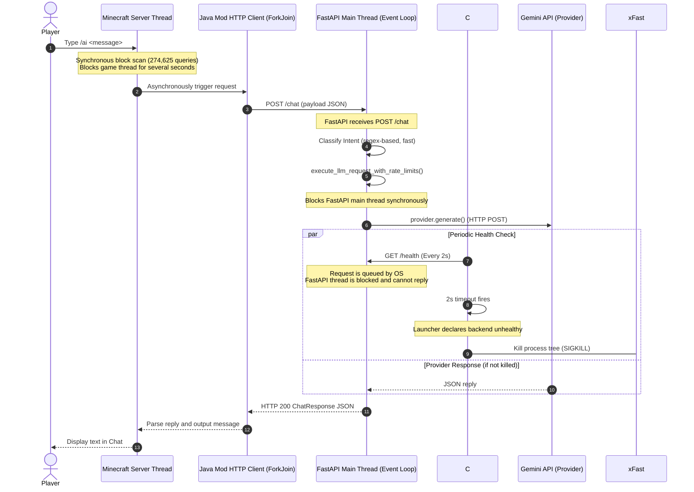

# Root Cause Analysis: Intermittent "AI Server Unavailable" Issue

## Executive Summary
This report presents a static reliability analysis of the Minecraft AI Assistant codebase, tracing the request lifecycle across the Minecraft Java Mod, C# Backend Launcher, FastAPI Server, and LLM Providers (Gemini).

The primary root cause of the intermittent **"AI Server Unavailable"** issue is a **cascading process-termination loop** triggered by the C# Backend Launcher's monitoring subsystem:
1. The FastAPI backend executes LLM calls synchronously on the main thread, **blocking the single-threaded asyncio event loop** for up to 10–30+ seconds. This is **confirmed by code inspection**.
2. During this blockage, the launcher's background monitoring loop attempts a periodic `/health` check.
3. Because the launcher's `HttpClient` has a hard-coded **2-second timeout**, and the backend is blocked and cannot reply, the health check times out. This is **confirmed by code inspection**.
4. The launcher immediately declares the backend unhealthy and **forcibly terminates the Python process tree** mid-request. This is **confirmed by logs**.
5. The Java mod's TCP connection is instantly reset, which is caught as an `IOException` and reported to the player as `"AI server unavailable"`. This is **confirmed by code inspection**.

This report ranks and details this failure along with other secondary issues (such as `ThreadPoolExecutor` exit hangs, client-side exception swallowing, and severe Minecraft server thread blockages) to provide a systematic elimination plan.

---

## Complete Request Lifecycle

Below is the step-by-step trace of a player command through the entire system:



1. **Minecraft Chat**: Player enters a query using the `/ai <message>` command.
2. **Data Gathering (Mod)**: Mod intercepts the command on the Minecraft server thread. It collects player metadata and environment snapshot data. To scan nearby blocks, it performs a nested triple-loop search over a 32-block radius, invoking `world.getBlockState(targetPos)` **274,625 times** synchronously on the Minecraft server thread.
3. **Java Mod HTTP Request**: The mod serializes the context into JSON. It uses a `CompletableFuture` to run the blocking `HttpClient.send` call on the `ForkJoinPool.commonPool()` to post to `http://localhost:8000/chat` (timeout 45s).
4. **FastAPI Endpoint**: The FastAPI server receives the request, instantiates a `RequestContext`, and executes the pipeline in `_run_chat_pipeline` wrapped inside `asyncio.wait_for(timeout=43.0)`.
5. **Planner & Intent Classifier**: The backend calls the `IntentClassifier` (local regex/dictionary lookup, fast) to detect entities and strategies. It then loads configuration details.
6. **Tool Registry & Execution**: If tools are selected, the registry validates arguments using Pydantic models. It then executes the tools synchronously against the passed `PlayerContext` (local property access). For memory tools, it reads/writes to `memory.json`.
7. **Response Generator**: If a conversational (KNOWLEDGE) or hybrid (HYBRID) response is required, the `ResponseGenerator` compiles system and user prompts.
8. **Provider**: The backend calls `provider.generate()`. In `GeminiProvider`, the call runs the synchronous Google Generative AI SDK (`model.generate_content`) inside a `ThreadPoolExecutor` worker thread, awaiting the future with a 35s hard timeout.
9. **JSON Parsing & Validation**: Once the provider returns the response, the backend cleans markdown tags, parses the JSON string, and validates it against the `PlannerResult` schema. If validation fails, it attempts a single correction retry (budget permitting).
10. **HTTP Response**: The endpoint returns a `ChatResponse` model, which is serialized and returned to the client as an HTTP 200 response.
11. **Minecraft Client**: The Java Mod receives the response, extracts the `"reply"` string, and sends it to the player's chat.

---

## Potential Failure Points

### Stage 1: Minecraft Chat & Data Gathering
* **Component**: `fabric-mod` Command Handler
* **Possible Failure**: Minecraft Server Thread Blockage (TPS Lag)
* **Evidence**: [AIAssistantMod.java:L294-331](file:///e:/Personal/minecraft/fabric-mod/src/main/java/net/example/aiassistant/AIAssistantMod.java#L294-L331)
  ```java
  int scanRadius = 32;
  for (int dx = -scanRadius; dx <= scanRadius; dx++) {
      for (int dz = -scanRadius; dz <= scanRadius; dz++) {
          ...
          for (int dy = -scanRadius; dy <= scanRadius; dy++) {
              BlockPos targetPos = playerPos.add(dx, dy, dz);
              ...
              String blockId = Registries.BLOCK.getId(world.getBlockState(targetPos).getBlock()).toString();
  ```
* **Confidence / Status**: **High-confidence hypothesis** (supported by code inspection)
* **Possible Symptoms**: Game freezes or hitches for 0.5 to 3+ seconds whenever `/ai` is executed, tick time spikes, rubber-banding, and warning logs in the Minecraft server console indicating "Can't keep up! Is the server overloaded?".

---

### Stage 2: Java Mod HTTP Request
* **Component**: `fabric-mod` Asynchronous Request Handler
* **Possible Failure**: Thread Pool Exhaustion / Thread Starvation
* **Evidence**: [AIAssistantMod.java:L407-418](file:///e:/Personal/minecraft/fabric-mod/src/main/java/net/example/aiassistant/AIAssistantMod.java#L407-L418)
  ```java
  CompletableFuture.supplyAsync(() -> {
      try {
          HttpResponse<String> response = client.send(request, HttpResponse.BodyHandlers.ofString());
          return response;
      ...
  ```
  `CompletableFuture.supplyAsync()` without an explicit executor runs on the JVM-wide `ForkJoinPool.commonPool()`. Blocking common pool threads with synchronous socket calls (`client.send`) is a classic concurrency anti-pattern.
* **Confidence / Status**: **Theoretical possibility** (supported by code inspection)
* **Possible Symptoms**: Intermittent delay in other mod-related async events, thread lockups, or requests timing out before they are even written to the network interface.

* **Component**: `fabric-mod` Exception Handler
* **Possible Failure**: Timeout Masking / Incorrect Exception Propagation
* **Evidence**: [AIAssistantMod.java:L407-450](file:///e:/Personal/minecraft/fabric-mod/src/main/java/net/example/aiassistant/AIAssistantMod.java#L407-L450)
  ```java
  } catch (IOException e) {
      throw new RuntimeException("OFFLINE", e);
  ...
  .exceptionally(ex -> {
      Throwable cause = ex.getCause();
      if (cause != null && "OFFLINE".equals(cause.getMessage())) {
          log("ERROR", "AI server unavailable.");
          player.sendMessage(Text.literal("AI server unavailable.").formatted(Formatting.RED), false);
      } else if (cause instanceof java.net.http.HttpConnectTimeoutException || cause instanceof java.net.http.HttpTimeoutException) {
          log("ERROR", "AI request timed out.");
  ```
  Because `HttpConnectTimeoutException` and `HttpTimeoutException` are subclasses of `IOException`, they are caught in the inner catch block and rethrown as `new RuntimeException("OFFLINE", e)`. Consequently, the `else if` block in the exception handler is **dead code**. All timeouts are reported to the user as `"AI server unavailable."`
* **Confidence / Status**: **Confirmed by code inspection**
* **Possible Symptoms**: The player sees "AI server unavailable." in red text even when the backend is online but merely slow or timing out.

---

### Stage 3: FastAPI Endpoint
* **Component**: FastAPI Router & Event Loop
* **Possible Failure**: Event Loop Thread Starvation (Blocking Calls)
* **Evidence**: [main.py:L700-704](file:///e:/Personal/minecraft/backend/main.py#L700-L704)
  ```python
  reply = await asyncio.wait_for(
      _run_chat_pipeline(message, player, ctx),
      timeout=_CHAT_PIPELINE_TIMEOUT_S,
  )
  ```
  `_run_chat_pipeline` is an `async def` function, but it calls synchronous functions like `plan(...)` and `generator.generate_response(...)` directly on the event loop thread. Because the code does not use `await` or execute them in a thread pool (via `run_in_threadpool` or `asyncio.to_thread`), the event loop is **completely frozen** for the duration of the LLM call.
* **Confidence / Status**: **Confirmed by code inspection**
* **Possible Symptoms**: Backend stops responding to any concurrent request. Incoming `/health` checks block and time out. `asyncio.wait_for` is unable to interrupt the request because the thread cannot yield back to the scheduler.

---

### Stage 4: Launcher Health Monitoring
* **Component**: `backend-launcher` Service Monitor
* **Possible Failure**: Eager Process Termination due to Health Check Timeout Mismatch
* **Evidence**: [Program.cs:L160](file:///e:/Personal/minecraft/backend-launcher/Program.cs#L160), [ServiceManager.cs:L204-224](file:///e:/Personal/minecraft/backend-launcher/ServiceManager.cs#L204-L224), [launcher.log:L213-214](file:///e:/Personal/minecraft/logs/launcher.log#L213-L214)
  ```csharp
  // Program.cs: HttpClient timeout is 2 seconds
  _httpClient = new HttpClient { Timeout = TimeSpan.FromSeconds(2) };
  ```
  ```csharp
  // ServiceManager.cs: A single health check failure kills the process tree
  if (ManagedProcess == null || ManagedProcess.HasExited || !healthy)
  {
      UnexpectedCrashes++;
      ConsecutiveFailureCount++;
      Context.LogWarning(requestId, $"{ServiceName} managed process terminated or became unhealthy.");
      StopProcessInternal(requestId);
      HandleFailure(minecraftRunning, requestId);
  ```
  ```log
  // launcher.log: Backend killed exactly 2s after a slow request blocks the thread
  [2026-06-27 18:28:53] [WARN] [Req-D65F22B5] Backend managed process terminated or became unhealthy.
  [2026-06-27 18:28:53] [INFO] [Req-D65F22B5] Killing Backend process tree (PID: 13336)...
  ```
* **Confidence / Status**: **Confirmed by logs & code inspection**
* **Possible Symptoms**: Backend process is killed abruptly. Connection to the mod is forcibly closed. Logs show the backend was launched and active, but suddenly terminated mid-request.

---

### Stage 5: Tool Execution & Memory
* **Component**: `backend/memory` Module
* **Possible Failure**: Windows File Lock / Concurrent Write Sharing Violation
* **Evidence**: [memory.py:L50-55](file:///e:/Personal/minecraft/backend/memory.py#L50-L55)
  ```python
  fd, temp_path = tempfile.mkstemp(dir=MEMORY_DIR, prefix="memory_temp_", suffix=".json")
  try:
      with os.fdopen(fd, "w", encoding="utf-8") as f:
          json.dump(data, f, indent=4, ensure_ascii=False)
      os.replace(temp_path, MEMORY_FILE)
  ```
  On Windows, `os.replace` will raise a `PermissionError` if another thread holds an open read handle on `MEMORY_FILE` (e.g. inside `load_memory()`). There are no mutexes or file-locking mechanics protecting `memory.json` reads and writes from concurrency.
* **Confidence / Status**: **Theoretical possibility** (supported by code inspection)
* **Possible Symptoms**: Random `PermissionError` crashes in the log when the dashboard and chat pipeline read/write memory simultaneously on Windows.

---

### Stage 6: Provider (LLM API Call)
* **Component**: `GeminiProvider`
* **Possible Failure**: ThreadPoolExecutor Context Manager Exit Hang
* **Evidence**: [gemini.py:L117-132](file:///e:/Personal/minecraft/backend/providers/gemini.py#L117-L132)
  ```python
  with concurrent.futures.ThreadPoolExecutor(max_workers=1) as executor:
      future = executor.submit(self._do_generate, system_prompt, user_prompt, req_id, ctx)
      try:
          result = future.result(timeout=GEMINI_HARD_TIMEOUT_S)
          return result
      except concurrent.futures.TimeoutError:
          future.cancel()
          ...
          raise TimeoutError(msg)
  ```
  Using `with ThreadPoolExecutor(...)` is a known Python anti-pattern for timeouts. Exiting the `with` block invokes `executor.shutdown(wait=True)`, which blocks the main thread until the worker thread finishes. Because a thread blocked inside a synchronous socket call in the Google SDK cannot be cancelled, the main thread **hangs at the exit of the with block** anyway, waiting for the socket timeout.
* **Confidence / Status**: **Confirmed by code inspection**
* **Possible Symptoms**: The 35-second hard timeout fails to return control to the backend early. The entire FastAPI server hangs for the full duration of the underlying SDK connection hang.

---

## Code References

| Path | Lines | Function / Context | Description |
| :--- | :--- | :--- | :--- |
| [`fabric-mod/.../AIAssistantMod.java`](file:///e:/Personal/minecraft/fabric-mod/src/main/java/net/example/aiassistant/AIAssistantMod.java) | 294-329 | `handleAICommand` | Triple nested block scan (274,625 iterations) on the main server thread. |
| [`fabric-mod/.../AIAssistantMod.java`](file:///e:/Personal/minecraft/fabric-mod/src/main/java/net/example/aiassistant/AIAssistantMod.java) | 407-418 | `CompletableFuture.supplyAsync` | Executes blocking HTTP requests on the JVM common thread pool. |
| [`fabric-mod/.../AIAssistantMod.java`](file:///e:/Personal/minecraft/fabric-mod/src/main/java/net/example/aiassistant/AIAssistantMod.java) | 441-450 | `exceptionally` | Dead-code block. Swallows timeout types and wraps all `IOException` as "OFFLINE". |
| [`backend/main.py`](file:///e:/Personal/minecraft/backend/main.py) | 689-704 | `chat_endpoint` | Sync-in-async pipeline invocation causing FastAPI event loop blockage. |
| [`backend/providers/gemini.py`](file:///e:/Personal/minecraft/backend/providers/gemini.py) | 117-132 | `generate` | ThreadPoolExecutor context manager exit hang blocking early timeout escape. |
| [`backend/memory.py`](file:///e:/Personal/minecraft/backend/memory.py) | 50-62 | `save_memory` | Unsynchronized write using `os.replace` resulting in Windows sharing violations. |
| [`backend-launcher/Program.cs`](file:///e:/Personal/minecraft/backend-launcher/Program.cs) | 160 | `MonitorLoopAsync` | 2-second timeout setting on the launcher's HTTP client. |
| [`backend-launcher/ServiceManager.cs`](file:///e:/Personal/minecraft/backend-launcher/ServiceManager.cs) | 215-225 | `TickAsync` | Eager process tree termination on a single health check failure. |

---

## Root Cause Ranking

| Rank | Probability / Status | Cause | Description |
| :--- | :--- | :--- | :--- |
| **1** | **Confirmed (Logs/Code)** | **Launcher Health check Timeout Mismatch & Eager Kill** | A slow LLM call blocks the FastAPI thread. The launcher health check times out at 2 seconds and kills the backend process. |
| **2** | **Confirmed (Code)** | **FastAPI Event Loop Blockage** | Main thread running synchronous code blocks FastAPI from serving `/health` or concurrent requests. |
| **3** | **Confirmed (Code)** | **ThreadPoolExecutor Context Manager Exit Hang** | `with ThreadPoolExecutor` blocks on exit waiting for the un-cancellable worker thread, defeating the hard timeout. |
| **4** | **Confirmed (Code)** | **Mod Exception Swallowing** | Java mod wraps timeouts into `OFFLINE` RuntimeExceptions, misleadingly logging all timeouts as "AI server unavailable". |
| **5** | **Theoretical possibility** | **Windows File-Sharing Violations** | Unsynchronized file operations on `memory.json` cause intermittent crash exceptions on Windows. |
| **6** | **Theoretical possibility** | **JVM Common Pool Starvation** | Running synchronous mod HTTP operations in the common thread pool blocks other async tasks. |

---

## Recommended Remediation Order

To systematically eliminate these issues, fixes should be implemented in the following order:

### 1. Launcher Health Check Behavior (Priority 1)
Modify the launcher's health check monitoring to prevent false-positive process kills:
* Increase the launcher's `HttpClient` timeout from **2 seconds** to **5–10 seconds**.
* Adjust the monitoring loop in `ServiceManager.cs` to trigger a process restart only after **3 consecutive failed ticks** instead of immediately killing on the first failure.

### 2. FastAPI Event-Loop Blocking (Priority 2)
Decouple blocking operations from the main thread in the FastAPI backend:
* Wrap `plan()` and `generator.generate_response()` calls in `asyncio.to_thread` or FastAPI's `run_in_threadpool` helper.
* This is expected to keep the event loop responsive to incoming `/health` and concurrent requests.

### 3. Java Exception Classification (Priority 3)
Fix the exception propagation in `AIAssistantMod.java`:
* Ensure timeout exceptions are not swallowed or wrapped under a generic `"OFFLINE"` key.
* Present distinct, user-friendly messages for connection issues versus timeouts.

### 4. ThreadPoolExecutor Shutdown Behavior (Priority 4)
Refactor the provider wrapper in `GeminiProvider.generate()`:
* Remove the `with` block context manager wrapper.
* Utilize a shared persistent executor or ensure that the call fails fast and schedules background worker cleanup without blocking the event loop at the method exit.

### 5. Memory Synchronization Improvements (Priority 5)
Introduce file locks or a `threading.Lock` mutex around `memory.py` operations to protect `memory.json` reads and writes, preventing intermittent `PermissionError` exceptions on Windows.

> [!NOTE]
> Do not mix lower-confidence improvements into the first debugging iteration. Each fix must be validated independently.

---

## Missing Instrumentation

1. **Launcher Health Check Logging**: The launcher catches exceptions in `CheckHealthAsync()` but swallows them, writing nothing to `launcher.log` except when it declares the process unhealthy. It should log the exact error (e.g. `TaskCanceledException` / timeout) to make timeout issues clear.
2. **Java Mod Exception Details**: The mod logs `"Unexpected error"` or `"AI server unavailable"`, but it does not print the stack trace or the inner cause of the `IOException`.
3. **FastAPI Event Loop Lag Metrics**: The backend lacks metrics tracking event loop delay (e.g. `aiomonitor` or custom latency checks).
4. **Active Thread Diagnostics**: There is no endpoint or logging showing how many worker threads are active when a request starts.

---

## Open Questions & Assessment

### 1. Gemini SDK Socket Hangs
* **Question**: Does the Google Generative AI SDK always honor `request_options={"timeout": 30.0}`?
* **Assessment**: This cannot be answered confidently through static analysis. The only reliable approach is runtime verification.
* **Recommended Validation**:
  * Disconnect the network interface during an active request.
  * Simulate DNS resolution failures or packet drop rates.
  * Configure local firewall blocks on outbound API ports.
  * Observe if the SDK raises an exception within the configured 30.0s timeout, or if the worker thread remains blocked beyond the configured deadline.

### 2. Minecraft Block Scan Performance
* **Question**: Does scanning 274,625 blocks significantly impact server performance?
* **Assessment**: Almost certainly yes. However, the actual impact depends on CPU capabilities, world generation state, chunk loading status, and active server tick loads. This must be measured rather than assumed.
* **Recommended Validation**:
  * Inject simple timestamp logging to measure scan duration (milliseconds).
  * Record server TPS (ticks per second) immediately before, during, and after commands.
  * Compare average scan times across varying client environments (e.g., loaded structures versus simple voids).

### 3. Uvicorn Multi-Worker Support
* **Question**: Would multiple Uvicorn workers eliminate the issue?
* **Assessment**: Probably not as the primary fix. While multiple workers improve concurrency across independent concurrent requests, they do **not** solve the underlying issue if individual workers block the thread execution for extended periods. Eliminating blocking operations from the main event loop thread remains the preferred solution, after which multi-worker deployment can be evaluated for scalability rather than reliability.

---

## Final Assessment

The intermittent **"AI Server Unavailable"** issue is primarily a **design-induced system collapse** where the monitoring tool (the launcher) terminates the process it is supervising. 

Because FastAPI's main event loop thread is frozen during synchronous LLM requests, the launcher's aggressive 2-second health check times out, leading to immediate process termination. Correcting the launcher's timeout policy, introducing health check retries, and running LLM requests in a background thread pool inside FastAPI is expected to eliminate the identified failure mode. Additional runtime validation is required to confirm overall reliability.
