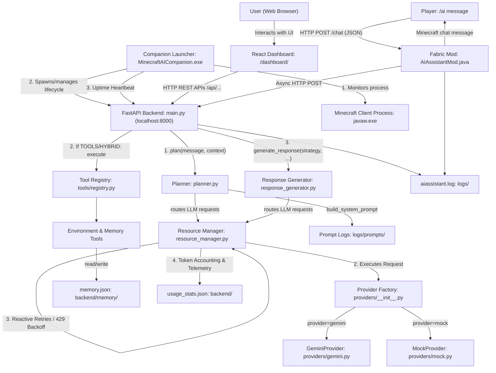
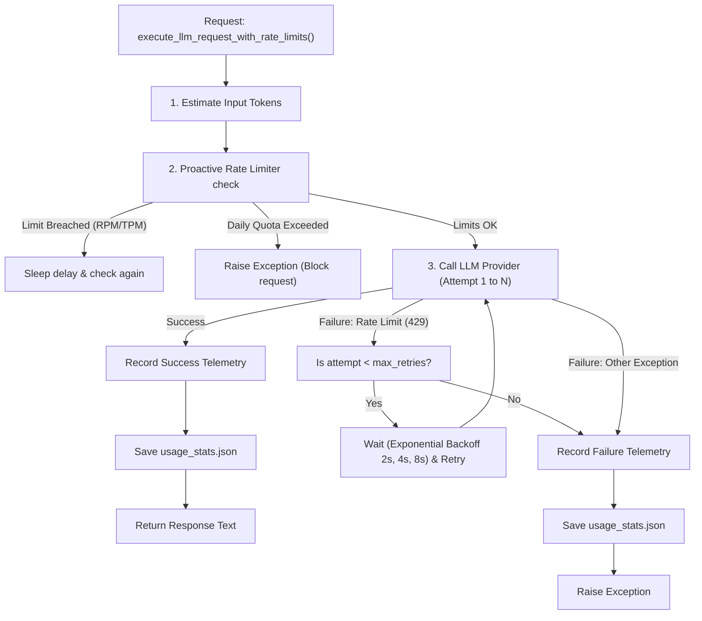
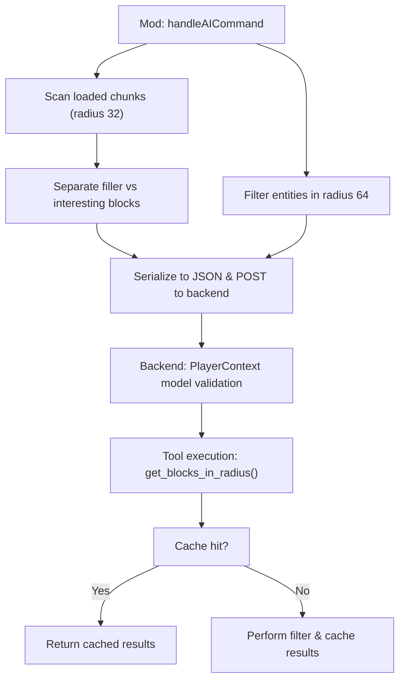
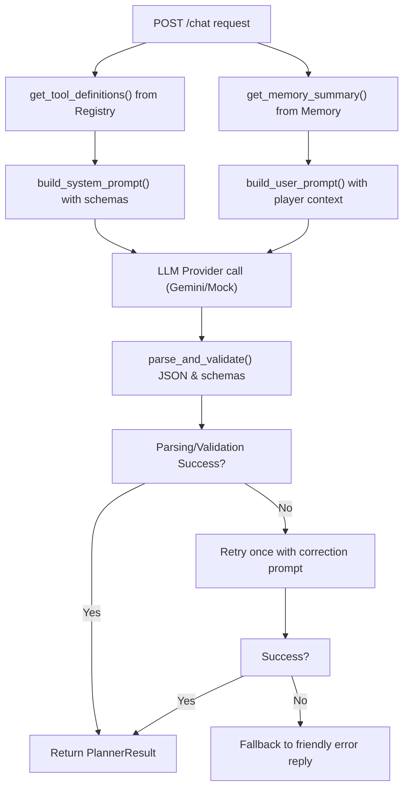
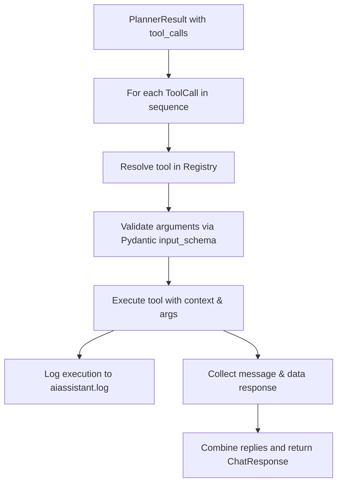
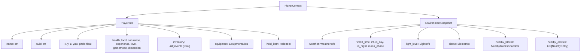

# 🧱 MinecraftAI — In-Game AI Assistant

> A Fabric mod + Python backend that brings a context-aware, memory-persistent AI assistant directly into Minecraft Java Edition — powered by Google Gemini.

---


---

<!-- BANNER: A future banner image showing the Minecraft game window with an AI chat reply visible in the chat box would be ideal here. -->

---

## Overview

**MinecraftAI** bridges Minecraft Java Edition and a large language model through a clean, local HTTP API. When a player types `/ai <message>`, the Fabric mod collects their full game context — position, inventory, equipment, nearby blocks, nearby entities, weather, world time, light level, and biome details — and sends it as structured JSON to a FastAPI backend running on `localhost:8000`. The backend passes the data through an LLM-powered **Planner**, which classifies the request into one of three response strategies:

1. **KNOWLEDGE**: Answer general queries (combat mechanics, recipes, redstone, brewing, etc.) directly using the LLM's Minecraft expertise (no tools executed).
2. **TOOLS**: Execute raw tools (e.g. status checks, inventory searches, block scans) and return the raw output for direct queries.
3. **HYBRID**: Execute tools to check live game context, then synthesize those results with Minecraft knowledge to provide an intelligent, conversational response (e.g., "Can I craft a shield?").

The result is sent back to the mod, which displays it in the Minecraft chat. Crucially, the LLM **never executes tools itself** — it only decides *which* tools to call and *with what arguments*. All actual execution happens in validated Python code on the backend, and response formatting is handled by a dedicated **Response Generator** component.

The system is designed around three principles: **provider abstraction** (swap Gemini for any other LLM by changing one config line), **tool extensibility** (add new capabilities by implementing a single abstract class), and **persistent memory** (locations and notes survive server restarts via `memory.json`).

---

## Features

### ✅ Current Features

- **Long-Term AI Personality Dashboard** — A permanent, dedicated `❤️ Personality` tab in the React Dashboard that allows configuring, editing, and saving custom companion instructions (stored locally at `backend/data/personality.md`) dynamically without backend restarts.
- **AI Evaluation Recorder & Screenshot Capture** — Automatically records a timestamped snapshot of every `/ai` request under `evals/` containing the exact question, final answer, player state, timings, planner reasoning, chosen tools, and a full base64-encoded game screenshot.
- **AI Resource Manager & React Dashboard** — A dedicated provider-agnostic resource manager that tracks input/output token usage, moving average latency, and session stats. Restricts queries via RPM, TPM, and RPD rate limits with automatic sleep-delay queueing and exponential backoff retry handling for rate-limit warnings. Exposes a local, beautiful Minecraft-themed React visual dashboard at `/dashboard/` for remote configuration updates, memory CRUD editing, event logging console, and live stats charts.
- **Automatic Companion Launcher** — A standalone C# Windows background utility (`MinecraftAICompanion.exe`) that automatically monitors for Minecraft launching, starts the FastAPI backend server, and shuts it down when Minecraft exits. Features status notifications, duplicate prevention, and zero-leak Windows Job Objects.
- **`/ai <message>` Fabric command** — triggers the AI assistant in-game from any player message.
- **Environment & Player Perception** — automatically collects player position, health, hunger, saturation, experience progress/level, gamemode, dimension, inventory items, equipped gear, weather, time, light level, biome, nearby entities, and surrounding block data. Includes case-insensitive waypoint matching (e.g. 'base alpha' resolves correctly to 'base Alpha').
- **Short-Lived Scan Caching** — scans are cached within a single request context. Repeated queries for blocks or entities during a single planning pipeline reuse scan results to maintain zero lag.
- **Smart Block Scanning** — scans a 32-block cube without generating chunks. Distinguishes between filler blocks (stone, dirt, grass, sand, water, lava, etc.) and interesting blocks (ores, chests, wood, crops), capping coords to maintain low JSON payload sizes.
- **Entity Awareness** — captures nearby players, villagers, passive/hostile mobs, projectiles, and vehicles within a 64-block radius, including distance, health, and location.
- **Hybrid Knowledge & Tool-Based Reasoning** — classifies every request into one of three strategies:
  - **Knowledge-Only**: Answers general queries (combat mechanics, recipes, redstone, brewing, etc.) directly using the LLM's Minecraft expertise (no tools executed).
  - **Tool-Required**: Executes raw tools (e.g. status checks, inventory searches, block scans) and returns the raw output for direct queries.
  - **Hybrid**: Executes tools to check live game context, then synthesizes those results with Minecraft knowledge to provide an intelligent, conversational response (e.g., "Can I craft a shield?").
- **Dedicated Response Generator** — isolates response formatting and LLM synthesis from planning, providing a scalable foundation for multi-step reasoning.
- **LLM Planner** — sends structured system + user prompts to Gemini, classifies queries via `ResponseStrategy`, and parses the structured JSON response.
- **Tool execution engine** — validates and dispatches LLM-selected tools in sequence.
- **Built-in tools:**
  - **Memory:** `save_location`, `load_location`, `list_locations`, `save_note`.
  - **Player Perception:** `get_player_status`, `get_held_item`, `get_equipment`, `get_inventory`.
  - **World Perception:** `get_weather`, `get_time`, `get_light_level`, `get_biome`.
  - **Environment Perception:** `get_nearby_blocks`, `scan_area`, `find_nearest`, `get_nearby_entities`.
- **Persistent memory** — `memory.json` survives server restarts; writes use atomic temp-file replacement to prevent corruption.
- **Memory injection into prompts** — known locations and notes are summarised and injected into every LLM call so the AI is always context-aware.
- **Automatic retry logic** — if the LLM returns malformed JSON or fails schema validation, the planner sends a correction prompt and retries once.
- **Provider abstraction** — `BaseLLMProvider` ABC lets you swap Gemini for any future provider without touching business logic.
- **Mock provider** — a fully deterministic rule-based `MockProvider` for offline development and unit testing.
- **Structured output enforcement** — Gemini is called with `response_mime_type: "application/json"` to minimise markdown wrapping.
- **Pydantic validation everywhere** — all tool arguments, player context, and API schemas are validated with Pydantic v2.
- **Dual logging** — all requests, responses, tool executions, and errors are logged to `logs/aiassistant.log` by both the mod (Java) and backend (Python).
- **Prompt debug logging** — every generated system + user prompt pair is saved to `logs/prompts/<timestamp>.txt` for inspection.
- **Graceful error handling** — backend offline, timeout, rate limiting, and malformed responses all result in a clean, friendly in-game message rather than a crash.
- **Health endpoint** — `GET /health` returns `{"status": "healthy"}` for uptime monitoring.
- **Unit test suite** — 43 tests across three test files covering memory, planner, tools, providers, retry logic, perception models, scanning calculations, and the full HTTP request/response cycle.
- **Interactive Tool Explorer** — a standalone `tools.html` dashboard (Minecraft-themed, zero dependencies) that dynamically loads `tools.json` to browse, search, and inspect every registered tool with full parameter schemas, examples, and planner trigger phrases.

### 🔲 Planned Features (Phase 4B+)

- **Safe block placement and breaking tools** — allow the AI to construct or destroy blocks in defined, safe areas.
- **Whitelisted Minecraft commands** — AI-selected commands dispatched through the server console.
- **Multi-tool chaining with result passing** — allow a tool's output to feed the next tool's input.
- **Datapack generation** — generate and apply custom datapacks from natural language descriptions.
- **Multi-agent architecture** — multiple AI agents for different concerns (builder, advisor, memory manager).
- **Natural language world editing** — describe a structure in plain English and have it built.

---

## Demo

### React Dashboard UI

Here is a visual overview of the React Dashboard interface demonstrating telemetry charts, configuration panels, memory editing, and the log terminal:


> Screenshots and recordings of the Fabric Mod in-game chat to be added once the project has a public release.

| Type | Placeholder |
|---|---|
| Screenshot | `docs/screenshot_chat.png` — AI reply displayed in Minecraft chat |
| GIF | `docs/demo.gif` — typing `/ai remember this place as home` and getting a confirmation |
| Video | `docs/demo.mp4` — full walkthrough: backend startup to in-game command to memory recall |

---

## Architecture

### Core Pipeline Flowchart
```
User Query
    ↓
Intent Classifier
    ↓
Intent Confidence Check (with fallback threshold)
    ↓
Planner Strategy Selection (KNOWLEDGE / TOOLS / HYBRID)
    ↓
Decision Validation Layer (Contradiction Checks)
    ↓
Candidate Tool Ranking
    ↓
Final Tool Selection
    ↓
Tool Execution (using validated Python scripts)
    ↓
Hybrid Response Generator (context synthesis, if required)
    ↓
LLM Provider Call
    ↓
Final Response
    ↓
Telemetry & Diagnostics (RequestContext Logging)
    ↓
Minecraft UI Chat Output
```

### System Flow


### AI Resource Manager Execution Flow

```

### Environment Awareness Scan Flow


### Planner Pipeline


### Tool Execution Engine


### Component Descriptions

| Component | Location | Responsibility |
|---|---|---|
| **Fabric Mod** | `fabric-mod/.../AIAssistantMod.java` | Registers `/ai` command, scans chunks and entities, packages JSON context, displays replies in chat |
| **FastAPI Backend** | `backend/main.py` | Exposes `/chat`, `/health`, and REST endpoints; serves the static React Dashboard |
| **React Dashboard** | `dashboard/src/...` | Single-page UI for system monitoring, live settings, memory CRUD, tool explorer, and log console |
| **AI Resource Manager** | `backend/resource_manager.py` | Single LLM gateway managing statistics, rate limits (RPM, TPM, RPD), retries, telemetry, and heartbeats |
| **PlayerContext** | `backend/context.py` | Pydantic model refactored into `PlayerInfo` and `EnvironmentSnapshot` with full backward compatibility |
| **Planner** | `backend/planner.py` | Builds prompts, calls LLM provider through Resource Manager gateway, classifies queries, validates structure |
| **Response Generator** | `backend/response_generator.py` | Synthesizes final response via Resource Manager gateway, combining context and tool results |
| **Provider Factory** | `backend/providers/__init__.py` | Factory function retrieving the configured `BaseLLMProvider` |
| **GeminiProvider** | `backend/providers/gemini.py` | Calls Google Gemini API, captures token counts from metadata, handles dynamic key loading |
| **MockProvider** | `backend/providers/mock.py` | Rule-based LLM simulator supporting all Phase 2 and Phase 4A intents for offline tests |
| **Tool Registry** | `backend/tools/registry.py` | Manages tool registration, resolving, and argument validation |
| **BaseTool** | `backend/tools/base.py` | Abstract Base Class specifying tool properties (`name`, `description`, `input_schema`, `execute`) |
| **Memory Manager** | `backend/memory.py` | Persistent JSON memory storage using safe temp-file replacement |
| **Config Loader** | `backend/config.py` | Handles runtime configurations loaded on each request (provider settings, rate limits) |

---

## PlayerContext Hierarchy

`PlayerContext` encapsulates all data gathered by the Fabric Mod and sent to the backend. It consists of two logical structures:



### Pydantic Models Overview

- **`PlayerInfo`**: Represents the current player status (coordinates, health, level, inventory slots, equipped slots, held item details).
- **`EnvironmentSnapshot`**: Represents the state of the surrounding Minecraft world (weather, time, light level, biome details, nearby block counts, nearby entities).
- **`InventorySlot`**: Contains slot index, item ID, stack count, durability, custom display name, and enchantments.
- **`EquipmentSlots`**: Helmet, chestplate, leggings, boots, and offhand slots.
- **`WeatherInfo`**: Boolean flags for clear/rain/thunder, and ticks remaining.
- **`LightInfo`**: Sky light, block light, and combined light levels.
- **`BiomeInfo`**: Biome registry ID, temperature, rainfall, and inferred category.
- **`NearbyEntity`**: Entity ID, display name, category (hostile/passive/villager/etc.), distance, health, and absolute coordinates.
- **`NearbyBlocksSnapshot`**: Split into `filler_blocks` (stone, dirt, grass, etc. - count and nearest occurrence) and `interesting_blocks` (exact coordinates of chests, ores, etc.).

---

## Project Structure

```
minecraft/
├── README.md
├── tools.json                  # Auto-generated tool registry catalog (16 tools)
├── tools.html                  # Standalone interactive Tool Explorer dashboard
├── Parameters.md               # Original project specification and vision
├── CHANGELOG.md                # Project changelog tracking versioned releases
├── .gitignore
│
├── backend/                    # Python FastAPI backend
│   ├── main.py                 # FastAPI app, REST APIs, serving static dashboard
│   ├── planner.py              # LLM planner: prompt generation, provider calls, retry logic
│   ├── context.py              # PlayerContext and perception Pydantic models
│   ├── memory.py               # Persistent memory: load, save, atomic write, summary
│   ├── config.py               # config.json loader with defaults and dynamic dotenv reloading
│   ├── config.json             # Runtime config: provider name, model, rate limits
│   ├── resource_manager.py     # AI Resource Manager: token tracker, rate limiter, retries
│   ├── usage_stats.json        # Persistent usage metrics and token telemetry logs
│   ├── .env                    # Secret keys (git-ignored)
│   ├── .env.example            # Template for .env
│   ├── requirements.txt        # Python dependencies
│   ├── test_phase2.py          # Unit tests: memory, tools, planner, player context
│   ├── test_phase3.py          # Integration tests: HTTP endpoints, retry, providers, config
│   ├── test_phase4a.py         # Perception tests: environment scanning, weather, entities, cache
│   ├── test_resource_manager.py # Unit tests: token tracking, rate limits, retries
│   │
│   ├── providers/              # LLM provider abstraction layer
│   │   ├── __init__.py         # get_provider() factory function
│   │   ├── base.py             # BaseLLMProvider ABC
│   │   ├── gemini.py           # Google Gemini implementation extracting token metadata
│   │   └── mock.py             # Deterministic mock for offline testing
│   │
│   ├── tools/                  # Tool registry and implementations
│   │   ├── __init__.py         # Re-exports registry singleton
│   │   ├── base.py             # BaseTool ABC
│   │   ├── registry.py         # ToolRegistry: register, resolve, validate, execute
│   │   ├── helpers.py          # Short-lived caching, Chebyshev scanning, direction math
│   │   ├── save_location.py    # Saves player coordinates to memory
│   │   ├── load_location.py    # Retrieves named coordinates from memory
│   │   ├── list_locations.py   # Lists all saved location names
│   │   ├── save_note.py        # Stores arbitrary key/value notes
│   │   ├── get_player_status.py # Queries player coordinates, health, level
│   │   ├── get_held_item.py    # Queries hand stack count and enchantments
│   │   ├── get_equipment.py   # Queries helmet, chestplate, boots, offhand
│   │   ├── get_inventory.py    # Lists inventory with optional search filters
│   │   ├── get_weather.py      # Queries clear/rain/thunder and remaining ticks
│   │   ├── get_time.py         # Queries world ticks and moon phases
│   │   ├── get_light_level.py  # Queries block, sky, and combined light levels
│   │   ├── get_nearby_blocks.py # Filters nearby blocks by Chebyshev radius
│   │   ├── scan_area.py        # Summarises ores, trees, liquids, and terrain Y variation
│   │   ├── find_nearest.py     # Locates nearest block/entity with direction angle
│   │   ├── get_nearby_entities.py # Lists nearby players, villagers, and mobs
│   │   └── get_biome.py        # Queries current biome, temp, rainfall
│   │
│   └── memory/
│       └── memory.json         # Persistent memory store (git-ignored)
│
├── dashboard/                  # React Vite SPA Dashboard frontend
│   ├── src/                    # Dashboard React source code (App.jsx, main.jsx, index.css)
│   ├── dist/                   # Production build assets served statically by backend
│   ├── package.json            # NPM dependencies and scripts
│   ├── vite.config.js          # Vite configuration with relative base routing
│   └── .gitignore
│
├── fabric-mod/                 # Minecraft Fabric mod (Java)
│   ├── build.gradle            # Gradle build: Fabric Loom 1.7.4, Java 21
│   ├── gradle.properties       # Minecraft 1.21.1, Fabric Loader 0.16.5, mod version v0.4.3
│   ├── settings.gradle
│   ├── gradlew / gradlew.bat
│   └── src/main/
│       ├── java/net/example/aiassistant/
│       │   └── AIAssistantMod.java   # Mod entry point, /ai command, chunk scan, entity scan
│       └── resources/
│           └── fabric.mod.json       # Mod manifest: id, name, version, dependencies
│
└── logs/                       # Runtime logs (git-ignored)
    ├── aiassistant.log         # Unified request/response/error log
    └── prompts/                # Per-request prompt debug dumps
```

---

## Technology Stack

| Category | Technology | Version |
|---|---|---|
| **Minecraft** | Java Edition | 1.21.1 |
| **Mod Loader** | Fabric Loader | 0.16.5 |
| **Fabric API** | fabric-api | 0.102.0+1.21.1 |
| **Fabric Loom** | Build tooling | 1.7.4 |
| **Yarn Mappings** | Deobfuscation | 1.21.1+build.3 |
| **Java** | OpenJDK | 21 |
| **Python** | CPython | 3.10+ |
| **Web Framework** | FastAPI | >= 0.100.0 |
| **ASGI Server** | Uvicorn | >= 0.22.0 |
| **Data Validation** | Pydantic | >= 2.0.0 |
| **LLM (default)** | Google Gemini | Gemini 3.5 Flash |
| **Gemini SDK** | google-generativeai | >= 0.3.0 |
| **Env config** | python-dotenv | >= 1.0.0 |
| **HTTP (mod side)** | Java `java.net.http.HttpClient` | JDK 21 built-in |
| **JSON (mod side)** | Gson (via Fabric) | bundled |
| **Testing** | Python `unittest` + `fastapi.testclient` | stdlib |
| **Memory storage** | JSON file | — |
| **Dashboard Core** | React | 19.2.7 |
| **Dashboard Bundler** | Vite | 8.1.0 |
| **Dashboard Styles** | Vanilla CSS (Minecraft dark theme) | — |

---

## Installation

### Prerequisites

- **Java 21** (JDK). The repo includes a bundled JDK at `fabric-mod/.java-21/` for the Gradle build.
- **Python 3.10+**
- **Minecraft Java Edition 1.21.1** with Fabric Loader 0.16.5 installed.
- A **Google Gemini API key** (free tier available at [aistudio.google.com](https://aistudio.google.com)).

---

### 1. Clone the Repository

```bash
git clone https://github.com/<your-username>/MinecraftAI.git
cd MinecraftAI
```

---

### 2. Set Up the Python Backend

```bash
cd backend

# Create and activate a virtual environment
python -m venv venv

# Windows
venv\Scripts\activate

# macOS / Linux
source venv/bin/activate

# Install dependencies
pip install -r requirements.txt
```

---

### 3. Configure the Backend

**Step 1 — Create your `.env` file:**

```bash
cp .env.example .env
```

Edit `.env` and replace with your actual key:

```env
GEMINI_API_KEY=your_actual_api_key_here
```

**Step 2 — Review `config.json`:**

```json
{
    "provider": "gemini",
    "model": "gemini-2.5-flash"
}
```

This selects the LLM provider and model. Currently supported providers: `gemini`, `mock`.

---

### 4. Start the Backend Server (via Companion Launcher)

You do not need to manually manage the Python backend server. The project includes an **Automatic Companion Launcher** that manages the server lifecycle in the background.

1. Navigate to the `backend-launcher/publish` directory.
2. Run **`MinecraftAICompanion.exe`**.
3. The launcher will start in the system tray (slate blue icon) and enter monitoring mode.
4. When you launch Minecraft, the launcher will automatically:
   * Detect the Minecraft Java process.
   * Start the FastAPI backend server using the project's virtual environment.
   * Change its tray icon to green (Running) once the server reports healthy.
   * Automatically shut down the backend server when Minecraft exits, returning to monitoring mode.

*Note: You can double-click the system tray icon to open the Status Dashboard showing PID numbers, uptimes, and status details.*

#### Alternative: Manual CLI Startup (for Developers)
If you prefer running the backend manually via a command prompt:
```bash
# From inside the backend/ directory, with venv active
uvicorn main:app --host 127.0.0.1 --port 8000
```
Verify it is running by visiting `http://127.0.0.1:8000/health` (should return `{"status":"healthy"}`). You can access the **React Dashboard** by visiting `http://127.0.0.1:8000/dashboard/` or `http://127.0.0.1:8000/` in any modern web browser.

#### Running React Dashboard for Development (Optional)
If you want to run the Vite dev server with hot-reload:
```bash
cd dashboard
npm install
npm run dev
```
By default, the development server runs at `http://localhost:5173/`. It connects to the FastAPI REST endpoints running on port `8000`.

To build the static assets for FastAPI production deployment manually:
```bash
cmd.exe /c npm run build
```
This will compile the single-page application into the `dashboard/dist` folder, which is mounted automatically by the backend server.

---

### 5. Build the Fabric Mod

```bash
cd ../fabric-mod

# Windows
gradlew.bat build

# macOS / Linux
./gradlew build
```

The compiled `.jar` will be at:

```
fabric-mod/build/libs/aiassistant-1.0.0.jar
```

---

### 6. Install the Mod and Launch Minecraft

1. Copy `aiassistant-1.0.0.jar` into your Minecraft `mods/` folder.
2. Ensure Fabric Loader **0.16.5** and **Fabric API** are installed.
3. Launch Minecraft 1.21.1 with the Fabric profile.
4. Join a world (singleplayer or server).
5. Type `/ai hello` in chat.

---

## Configuration

### `backend/config.json`

Runtime configuration for the backend. Loaded on every request; no server restart required.

| Field | Type | Default | Description |
|---|---|---|---|
| `provider` | `string` | `"gemini"` | LLM provider to use. Currently supports `"gemini"` or `"mock"`. |
| `model` | `string` | `"gemini-2.5-flash"` | Model name passed to the provider. For Gemini: any valid Gemini model ID. |
| `enable_prompt_logging` | `boolean` | `true` | If `true`, each LLM call writes a `logs/prompts/<timestamp>.txt` debug file. |

**Example — switch to mock provider for local testing:**

```json
{
    "provider": "mock",
    "model": "mock-model"
}
```

---

### `backend/.env`

Secret keys. Never committed to version control (listed in `.gitignore`).

| Variable | Required | Description |
|---|---|---|
| `GEMINI_API_KEY` | Yes (for Gemini) | Your Google Gemini API key. Get one at [aistudio.google.com](https://aistudio.google.com). |

---

### `backend/.env.example`

Checked-in template:

```env
# Secret Keys Configuration
# Replace with your actual Gemini API Key
GEMINI_API_KEY=YOUR_API_KEY
```

---

## REST API Endpoints

The FastAPI backend exposes the following REST endpoints to communicate with the mod, companion launcher, and dashboard:

### General & Uptime
- **`GET /health`**
  - Heartbeat status indicator. Records companion launcher active check.
  - *Response:* `{"status": "healthy"}`

### AI Resource Manager
- **`GET /api/resources/stats`**
  - Delivers complete usage stats (tokens today, requests today, uptime, etc.), weekly daily summaries, and a sliding log of recent requests.
- **`GET /api/providers`**
  - Returns a list of supported AI providers, active models, default selection, and whether their API key is loaded.

### Configuration Manager
- **`GET /api/config`**
  - Returns current settings with API key masked (`********`).
- **`POST /api/config`**
  - Updates runtime configurations in `config.json` and updates `.env` dynamically.

### Log Streaming
- **`GET /api/logs`**
  - Returns parsed, categorized system logs (Tool Executions, Errors, General) from backend log files and launcher log files. Supports level, category, source, and text filters.

### Memory CRUD Operations
- **`GET /api/memory`**
  - Retrieves the complete persistent `memory.json` data (locations, notes, preferences).
- **`PUT /api/memory/locations/{name}`**
  - Adds or edits a named coordinate location memory (dimension, x, y, z, biome).
- **`DELETE /api/memory/locations/{name}`**
  - Deletes a named coordinate location memory.
- **`PUT /api/memory/notes/{key}`**
  - Adds or updates a named text note value.
- **`DELETE /api/memory/notes/{key}`**
  - Deletes a note by key.
- **`PUT /api/memory/preferences/{key}`**
  - Adds or updates a configuration preference.
- **`DELETE /api/memory/preferences/{key}`**
  - Deletes a preference by key.

### Tool Registry
- **`GET /api/tools`**
  - Returns a list of all 16 registered mod tools categorized with their Pydantic parameters, descriptions, and trigger phrase lists.

---

## Usage

All commands are entered in the Minecraft in-game chat. The `/ai` command accepts a free-form natural language message.

### Conversational Chat

```
/ai hello
```
> The AI responds with a friendly conversational reply. No tools are executed.

---

### Perception Queries (Phase 4A)

```
/ai check my status
```
> **Response:** `Player Steve status: Health 20.0/20, Hunger 20/20, Level 5, Gamemode survival, Dimension minecraft:overworld at X=120.4, Y=64.0, Z=-350.2.`

```
/ai what am i holding?
```
> **Response:** `Holding 1x minecraft:diamond_pickaxe (Enchantments: minecraft:efficiency 4). Durability: 1540 remaining.`

```
/ai what armor am i wearing?
```
> **Response:** `Equipped Gear: Helmet: minecraft:iron_helmet (minecraft:protection 1), Chestplate: minecraft:air, Leggings: minecraft:air, Boots: minecraft:air, Offhand: minecraft:shield.`

```
/ai do i have enough wood for a crafting table?
```
> **Response:** `Inventory Summary: - minecraft:oak_log: 12 - minecraft:torch: 4.` (Gemini will reason: "Yes, you have 12 oak logs, which is enough to make a crafting table.")

```
/ai is there lava nearby?
```
> **Response:** `Area Scan Report (Radius 16 in Biome: minecraft:plains): Terrain Y Range: 60 to 72, Blocks: Stone=2400, Trees/Leaves=0, liquids: Water=12, Lava=0.`

```
/ai where is the closest water?
```
> **Response:** `Found nearest block 'minecraft:water' at coordinates [124, 63, -345] (4.5 blocks away, direction: North).`

```
/ai are there monsters close to me?
```
> **Response:** `Nearby entities in radius 64m: - Hostile Mobs: Zombie (12.4m), Creeper (24.1m).`

```
/ai what biome am i in?
```
> **Response:** `You are currently in the biome 'minecraft:plains' (Category: plains, Temperature: 0.80, Rainfall: 0.40).`

---

### Memory & Notes

```
/ai remember this place as home
```
> **Response:** `Saved location 'home' at coordinates x=-109.6, y=71.0, z=-85.3 in minecraft:overworld.`

```
/ai where is home
```
> **Response:** `Loaded location 'home': coordinates are x=-109.6, y=71.0, z=-85.3 in minecraft:overworld.`

```
/ai list locations
```
> **Response:** `Saved locations: base, home.`

```
/ai remember that my dog is named buddy
```
> **Response:** `Saved note for 'dog_name': 'buddy'.`

---

## Tool System

Every tool must subclass `BaseTool` (`backend/tools/base.py`) and implement four abstract properties and one method:

```python
class BaseTool(ABC):
    name: str           # Unique identifier used by the planner and registry
    description: str    # Injected verbatim into the system prompt
    input_schema: Type[BaseModel]   # Pydantic model; JSON schema is serialised into the system prompt
    usage_examples: List[str]       # Natural language examples injected into the system prompt

    def execute(self, context: PlayerContext, arguments: Dict[str, Any]) -> Dict[str, Any]:
        # Must return {"status": "success"|"error", "message": str, "success": bool, "data": ..., "metadata": ...}
```

### Registered Tools

| Category | Tool Name | Arguments Schema | Description |
|---|---|---|---|
| **Memory** | `save_location` | `name: str` | Saves player's current coordinate context to persistent storage |
| **Memory** | `load_location` | `name: str` | Retrieves coordinate context for a saved name |
| **Memory** | `list_locations` | *(none)* | Returns all saved location names in memory |
| **Memory** | `save_note` | `key: str`, `value: str` | Saves a persistent note key/value pair |
| **Player** | `get_player_status` | *(none)* | Queries health, hunger, coordinates, rotation, level, dimension |
| **Player** | `get_held_item` | *(none)* | Queries held item in main hand (name, count, durability, enchantments) |
| **Player** | `get_equipment` | *(none)* | Queries helmet, chestplate, leggings, boots, offhand slots |
| **Player** | `get_inventory` | `search: Optional[str]` | Lists inventory items with optional partial name filter |
| **World** | `get_weather` | *(none)* | Queries rain, thunder, clear weather state, and time remaining |
| **World** | `get_time` | *(none)* | Queries world ticks, day/night status, and moon phase name |
| **World** | `get_light_level` | *(none)* | Queries block light, sky light, and combined light levels |
| **World** | `get_biome` | *(none)* | Queries current biome ID, temperature, rainfall, and category |
| **Environment** | `get_nearby_blocks` | `radius: int = 16` | Lists block types, counts, and nearest coordinates (radius 1-64) |
| **Environment** | `scan_area` | `radius: int = 16` | Returns structured high-level summary of surroundings and Y variation |
| **Environment** | `find_nearest` | `target_type: str` | Locates nearest block or entity matching query with relative direction |
| **Entities** | `get_nearby_entities` | `radius: int = 64` | Lists nearby players, villagers, passive/hostile mobs with distance |

### Execution Flow

```
POST /chat
  → plan(message, player_context)
      → build_system_prompt()        # inject tool schemas dynamically from registry
      → build_user_prompt()          # inject player context + memory summary
      → provider.generate()          # call LLM
      → parse_and_validate()         # validate JSON + tool args + response_strategy
      → PlannerResult
  → if strategy is TOOLS or HYBRID:
      → for tool_call in planned_result.tool_calls:
          → registry.execute(tool_name, player, arguments)
              → tool.input_schema(**arguments)  # Pydantic validation
              → tool.execute(context, args)     # business logic with cache lookup
              → {"status", "message", "success", "data", "metadata"}
  → ResponseGenerator.generate_response(strategy, message, context, tool_results, planner_reply)
      → If KNOWLEDGE: return planner_reply
      → If TOOLS: return tool_results
      → If HYBRID:
          → provider.generate()      # call LLM with synthesis prompt
          → parse "reply" from JSON
          → return synthesized reply
  → ChatResponse(reply, tool_calls)
```

---

## Tool Explorer

The project includes an **interactive Tool Explorer** — a standalone HTML dashboard for browsing, searching, and inspecting every registered tool.

### Files

| File | Purpose |
|---|---|
| `tools.json` | Auto-generated structured catalog of all 16 registered tools with full metadata |
| `tools.html` | Standalone Minecraft-themed HTML dashboard — no server, no dependencies, open in any browser |

### Opening the Explorer

Simply double-click `tools.html` or open it in any browser. It loads `tools.json` automatically (or uses an embedded fallback if fetch is unavailable on `file://` protocol).

### Features

- **Minecraft-Inspired Theme** — dark stone palette, creeper green highlights, redstone red warnings, category-specific accent colors.
- **Real-Time Search** — filter tools by name, description, category, parameter names, or tags.
- **Category Sidebar** — filter by Player, Environment, World, or Memory categories with live tool counts.
- **Expandable Tool Cards** — click any card to reveal full documentation: parameter table, output JSON schema, request/response examples, and planner trigger phrases.
- **Statistics Panel** — total tools, category count, average parameters per tool, latest phase, and project version.
- **Zero Dependencies** — all CSS and JavaScript embedded inline. No React, no build step, no server.
- **Future-Ready** — modular JavaScript structure designed for easy migration to a React dashboard.

### tools.json Schema

Each tool entry contains:

```json
{
  "name": "get_inventory",
  "category": "Player",
  "description": "Returns all player inventory items...",
  "parameters": [{"name": "search", "type": "string", "required": false, ...}],
  "returns": {"status": "string", "data": {...}},
  "examples": [{"request": {...}, "response": {...}}],
  "usage_examples": ["what's in my inventory?", ...],
  "source": "backend/tools/get_inventory.py",
  "version": "0.4.1",
  "phase": "Phase 4A",
  "tags": ["player", "inventory", "search", "read-only"]
}
```

---

## Testing

The project uses Python's built-in `unittest` framework with `fastapi.testclient` for integration tests.

### Running Tests

```bash
cd backend

# Run Phase 2 tests (memory, tools, planner)
python -m unittest test_phase2.py

# Run Phase 3 tests (endpoints, retry, providers, config)
python -m unittest test_phase3.py

# Run Phase 4A tests (perception, scanning, caching, tools)
python -m unittest test_phase4a.py

# Run all tests
python -m unittest discover -s .
```

---

## Logging

### `logs/aiassistant.log`

A unified append-only log written by both the Fabric mod (Java) and the FastAPI backend (Python) using the same format:

```
[2026-06-26 18:52:02] [INFO] Planning via provider 'gemini' using model 'gemini-2.5-flash'
[2026-06-26 18:52:03] [INFO] LLM responded in 0.94s
[2026-06-26 18:52:03] [INFO] Planner selected GET_PLAYER_STATUS
[2026-06-26 18:52:03] [INFO] GET_PLAYER_STATUS()
```

### Prompt Debug Logging

Every generated system + user prompt pair is saved to `logs/prompts/<timestamp>.txt` for debugging unexpected planner behavior. Can be disabled by setting `"enable_prompt_logging": false` in `config.json`.

---

## Roadmap

```
Phase 1 — Foundation                                     [COMPLETE]
  Fabric mod loads and registers /ai command
  Player context collection (XYZ, dimension, biome, health, food, gamemode, world time)
  Async HTTP POST to local FastAPI backend
  Gemini LLM integration
  Formatted reply displayed in Minecraft chat
  Graceful error handling (offline, timeout, bad JSON)
  Unified dual logging (mod + backend)

Phase 2 — Memory and Tools                               [COMPLETE]
  Persistent memory.json with atomic writes and corruption recovery
  save_location / load_location / list_locations / save_note tools
  Pydantic validation on all tool arguments
  Tool registry with structured success/error responses
  Memory summary injection into LLM prompts
  Unit test suite (9 tests)

Phase 3 — Planner Hardening and Integration Testing      [COMPLETE]
  Dynamic tool definition injection into system prompt
  Provider abstraction (BaseLLMProvider, factory pattern)
  MockProvider for offline/test mode
  Structured JSON output enforcement (Gemini JSON mode)
  Malformed JSON retry with correction prompt
  Validation failure fallback to friendly error reply
  Prompt debug logging to logs/prompts/
  Full integration test suite via FastAPI TestClient (10 tests)
  LLM latency measurement and logging

Phase 4A — Environment Awareness & World Perception      [COMPLETE]
  Refactored PlayerContext into PlayerInfo & EnvironmentSnapshot
  Loaded chunk-safe scanning & entity distance filtering
  Radius configuration, validation & clamping (1-64)
  Optimized filler block aggregation & interesting block coord listing
  Short-lived cache for single-request performance optimization
  12 new tools for player, world, environment, and entity awareness
  Comprehensive tests for perception models & calculations (18 tests)

Phase 4A.1 — Hybrid Knowledge & Tool-Based Reasoning      [COMPLETE]
  Strongly typed ResponseStrategy enum (KNOWLEDGE, TOOLS, HYBRID)
  Dedicated ResponseGenerator component for isolating response synthesis
  Hybrid reasoning pipeline: execute tools then synthesize response with LLM knowledge
  General knowledge passthrough bypassing tool execution for mechanics/recipes
  Comprehensive integration test suite (43 tests total)

Phase 4A.2 — Automatic Backend Companion Launcher       [COMPLETE]
  Windows system tray utility (MinecraftAICompanion.exe)
  Automatic Minecraft Java process monitoring and detection
  Lifecycle automation (start backend on Minecraft launch, stop on exit)
  Duplicate process prevention (attaching to manual instances via health check)
  Job Object integration to prevent orphan python processes
  Lightweight Status Dashboard window and colored status icons

Phase 4A.3 — AI Resource Manager & React Dashboard       [COMPLETE]
  Intelligent provider-agnostic AI Resource Manager with telemetry, rate limiting, and backoff retries
  Active backend/launcher token accounting and query latency monitoring
  Dynamic reload of .env configuration settings without backend process restarts
  Modular REST API endpoints for remote settings, memory management, tool schemas, and logs
  FastAPI-integrated React SPA Dashboard with a custom Minecraft dark/Creeper green aesthetic
  Real-time charts, log viewer, Memory CRUD grid, and live configuration updates

Phase 4B — World Interaction & Intelligent Actions       [PLANNED]
  Safe block placement & breaking tools
  Consolidation of server whitelisted command dispatches
  Chaining results across multiple tool dispatches
  Natural language structure generation blueprints

Phase 5 — Advanced Capabilities                          [PLANNED]
  Datapack generation from natural language
  Custom item definitions
  Structure blueprints

Phase 6 — Multi-Agent and Ecosystem                      [PLANNED]
  Multi-agent architecture (builder, advisor, memory manager)
  Additional LLM providers (OpenAI, Ollama, OpenRouter)
  Natural language world editing
```

---

## Release Notes (v0.4.3)

### v0.4.3 — AI Resource Manager & React Dashboard
- **Intelligent Resource Management**: Built a provider-agnostic resource manager supporting proactive/reactive rate limiting (RPM, TPM, RPD) with automated sleep delays and exponential backoffs.
- **Detailed Telemetry & Token Accounting**: Captures token metadata directly from Gemini API calls and aggregates statistics locally into `usage_stats.json`.
- **FastAPI REST API Layer**: Exposed secure, masked REST endpoints for remote configuration updates, database memory CRUD operations, registered tools discovery, and log streaming.
- **Beautiful React Dashboard**: Developed a modern single-page frontend served natively at `/dashboard/` with a Minecraft dark/Creeper green aesthetic, SVG utilization charts, event log filter terminal, and memory editors.

---

## Release Notes (v0.4.2)

### v0.4.2 — Minecraft AI Companion Launcher
- **Automatic Lifecycle Automation**: Spawns the python backend on Minecraft startup and terminates it when Minecraft exits.
- **WMI Process Detection**: Inspects running Java client processes using command-line argument queries (`--gameDir`, `net.minecraft.client.main.Main`) to isolate the active game from other launcher applications.
- **Zero Duplicate Instances**: Performs `/health` queries before spawning the backend; if a healthy instance is already running (e.g. started manually), it attaches to it.
- **Orphan Prevention**: Uses native Windows Job Objects to ensure that all spawned Python background processes are automatically terminated if the launcher exits, crashes, or is killed.
- **Status Dashboard**: A dark-themed WinForms user interface showing Minecraft status, backend PID, launcher/backend uptimes, and last health checks, with a button to force restart the backend.
- **Flexible Configuration**: Provides `launcher_config.json` with configuration parameters for directories, executables, intervals, retry limits, and an `AutoStartBackend` toggle.

---

### v0.4.1 — Hybrid Knowledge & Tool-Based Reasoning (Patch)
- **Response Strategy Pipeline**: Replaced booleans with a strongly typed `ResponseStrategy` enum (`KNOWLEDGE`, `TOOLS`, `HYBRID`) allowing the AI to answer general/mechanics questions directly (`KNOWLEDGE`), execute tools directly (`TOOLS`), or run tools and synthesize responses (`HYBRID`).
- **Response Generator Component**: Added the `ResponseGenerator` component in `backend/response_generator.py` to decouple response formatting and LLM synthesis from planning.
- **Architectural Cleanup**: Updated FastAPI backend `/chat` endpoint to orchestrate planner classifications, execution, and final response synthesis through `ResponseGenerator`.
- **Testing & Verification**: Added integration tests in `test_phase4a.py` and consolidated Mock LLM Provider rules for offline and deterministic test runs.

---

## Contributing

Contributions are welcome. Please follow the conventions already established in the codebase.

### Coding Style

- **Python**: Follow PEP 8. All public functions and classes must have docstrings. Use Pydantic v2 models for all data validation.
- **Java**: Follow standard Java conventions. Keep code clean and async where possible.
- **Commit messages**: Use imperative present tense (`Add save_note tool`, not `Added save_note tool`).

### Architecture Philosophy

- **Observe before acting.** Environment perception must be complete and read-only before any interaction tools are created.
- **The LLM is a planner, not an executor.** The AI decides *what* to do but never *does* it. This prevents prompt injection, runaway tool calls, and hallucinated operations from affecting game state. Every tool call is validated against a Pydantic schema before it reaches any business logic.
- **Extensibility is structural, not accidental.** Adding a new tool, a new LLM provider, or a new memory category does not require modifying existing files — only adding new ones and registering them in the registry.
- **Fail gracefully, always.** Every network call, file operation, JSON parse, and schema validation is wrapped to return a user-visible message rather than crash the game or the server.
- **Offline-first testing.** The `MockProvider` and test isolation mean the entire backend can be developed and tested without a Minecraft instance or an API key.

## Current Capabilities

The Minecraft AI Assistant currently supports the following capabilities and tool perceptions:

- **Player Status Perceptions**: Coordinates (`x`, `y`, `z`), health status, food/hunger status, saturation, experience progress, levels, active gamemode, dimension (`minecraft:overworld`, `minecraft:the_nether`, `minecraft:the_end`), held item detection, and equipped gear (helmet, chestplate, leggings, boots, offhand shield).
- **World Context Perceptions**: Weather (rain, thunder, clear states), world time ticks (day/night phases), light levels (block, sky, and combined light levels), and biome categories (temperature, category name, precipitation).
- **Environment Perceptions**: High-performance local scans for surrounding blocks (caching for multiple tools), search queries to find the nearest target block or entity, and entities scanning (detecting villagers, hostile/passive mobs, vehicle types, projectiles, and players in a 64-block radius).
- **Memory System**: Local coordinates saving/retrieval as custom waypoints (e.g. `mining base`, `Home`), text memos saving, and listing all saved memories.
- **Hybrid Reasoning**: Synthesis of live game context and internal Minecraft crafting/recipe and survival domain knowledge to answer queries like "Should I fight these mobs?", "Is it safe to sleep?", or "Can I craft a Brewing Stand right now?".

---

## Developer Features

MinecraftAI includes several advanced developer features for debugging, profiling, and verification:

- **Planner Debug Log**: Detailed in-console printouts containing matched intent patterns, vocabulary components (mobs, items, blocks, structures), final intent confidence scores, candidate tool rankings, chosen planner decisions, rejected tools with specific reasons, and prompt template injection logs.
- **Diagnostics & Observability Layer**: An integrated `RequestContext` tracking system capturing model performance metrics, input/output token counts, and moving average query latency.
- **Validation Report Suite**: Fully offline, deterministic validation suite (`run_validation_report.py`) evaluating 10 target benchmark queries against 6 pipeline stages (Intent Classification, Strategy Selection, Candidate Tool Ranking, Final Tool Selection, Tool Execution, Response Generation), printing out a formatted markdown report.
- **Model Manager**: Configuration manager dynamically loading model profiles (`models_config.json`) with fine-grained API rate limits (RPM, TPM, RPD) and automated proactive check queueing.
- **Lifecycle Service Manager**: Standalone Windows executable orchestrating process health, Heartbeat checks, and automatic restart handling.

---

## Known Issues

### Hybrid Response Generation
Under certain hybrid queries requiring a second LLM synthesis pass, the backend may occasionally terminate unexpectedly, causing the launcher to automatically restart the backend process.

* **Current Status**: Active investigation in progress. Core planner, classifier, and tool execution remain fully operational. The issue appears isolated to the secondary response generation stage after successful tool execution.
* **Workaround**: If a crash occurs, the Standalone Launcher automatically detects the failure and restarts the backend process within seconds to restore service.

---

## Changelog

See [CHANGELOG.md](file:///e:/Personal/minecraft/CHANGELOG.md) for a complete history of releases and development milestones.

---

## Acknowledgements

- **[Fabric](https://fabricmc.net/)** — the lightweight, modular Minecraft mod loader.
- **[FastAPI](https://fastapi.tiangolo.com/)** — the high-performance Python web framework with first-class Pydantic integration.
- **[Pydantic](https://docs.pydantic.dev/)** — for robust, readable data validation across the entire backend.
- **[Google Gemini](https://ai.google.dev/)** — the LLM powering the planning engine.
- **[Gson](https://github.com/google/gson)** — JSON serialisation in the Fabric mod.
- **[python-dotenv](https://github.com/theskumar/python-dotenv)** — clean secret management.

---

## License

This project is licensed under the **MIT License** — see `fabric.mod.json` which declares `"license": "MIT"`.

```
MIT License

Copyright (c) 2026 MinecraftAI Contributors

Permission is hereby granted, free of charge, to any person obtaining a copy
of this software and associated documentation files (the "Software"), to deal
in the Software without restriction, including without limitation the rights
to use, copy, modify, merge, publish, distribute, sublicense, and/or sell
copies of the Software, and to permit persons to whom the Software is
furnished to do so, subject to the following conditions:

The above copyright notice and this permission notice shall be included in all
copies or substantial portions of the Software.

THE SOFTWARE IS PROVIDED "AS IS", WITHOUT WARRANTY OF ANY KIND, EXPRESS OR
IMPLIED, INCLUDING BUT NOT LIMITED TO THE WARRANTIES OF MERCHANTABILITY,
FITNESS FOR A PARTICULAR PURPOSE AND NONINFRINGEMENT. IN NO EVENT SHALL THE
AUTHORS OR COPYRIGHT HOLDERS BE LIABLE FOR ANY CLAIM, DAMAGES OR OTHER
LIABILITY, WHETHER IN AN ACTION OF CONTRACT, TORT OR OTHERWISE, ARISING FROM,
OUT OF OR IN CONNECTION WITH THE SOFTWARE OR THE USE OR OTHER DEALINGS IN THE
SOFTWARE.
```
