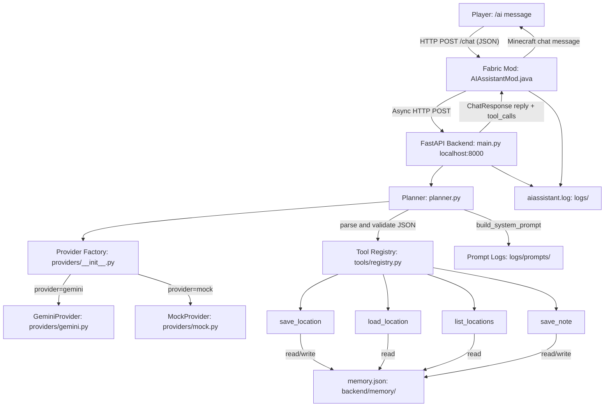

# 🧱 MinecraftAI — In-Game AI Assistant

> A Fabric mod + Python backend that brings a context-aware, memory-persistent AI assistant directly into Minecraft Java Edition — powered by Google Gemini.

---


---

<!-- BANNER: A future banner image showing the Minecraft game window with an AI chat reply visible in the chat box would be ideal here. -->

---

## Overview

**MinecraftAI** bridges Minecraft Java Edition and a large language model through a clean, local HTTP API. When a player types `/ai <message>`, the Fabric mod collects their full game context — position, dimension, biome, health, hunger, world time, and gamemode — and sends it as structured JSON to a FastAPI backend running on `localhost:8000`. The backend passes the data through an LLM-powered **Planner**, which decides whether to:

1. **Execute a tool** (e.g., save the player's current coordinates to memory, retrieve a saved location, store a note), or
2. **Return a conversational reply** (e.g., answer a question, respond to a joke).

The result is sent back to the mod, which displays it in the Minecraft chat. Crucially, the LLM **never executes tools itself** — it only decides *which* tools to call and *with what arguments*. All actual execution happens in validated Python code on the backend.

The system is designed around three principles: **provider abstraction** (swap Gemini for any other LLM by changing one config line), **tool extensibility** (add new capabilities by implementing a single abstract class), and **persistent memory** (locations and notes survive server restarts via `memory.json`).

---

## Features

### ✅ Current Features

- **`/ai <message>` Fabric command** — triggers the AI assistant in-game from any player message
- **Rich player context injection** — automatically collects position (X/Y/Z), yaw/pitch, dimension, biome, gamemode, health, food level, and world time
- **LLM Planner** — sends structured system + user prompts to Gemini and parses the structured JSON response
- **Tool execution engine** — validates and dispatches LLM-selected tools in sequence
- **Four built-in memory tools:**
  - `save_location` — saves current coordinates, dimension, and biome under a name
  - `load_location` — retrieves coordinates for a named location
  - `list_locations` — lists all saved location names
  - `save_note` — stores a key/value pair in persistent notes memory
- **Persistent memory** — `memory.json` survives server restarts; writes use atomic temp-file replacement to prevent corruption
- **Memory injection into prompts** — known locations and notes are summarised and injected into every LLM call so the AI is always context-aware
- **Automatic retry logic** — if the LLM returns malformed JSON or fails schema validation, the planner sends a correction prompt and retries once
- **Provider abstraction** — `BaseLLMProvider` ABC lets you swap Gemini for any future provider without touching business logic
- **Mock provider** — a fully deterministic rule-based `MockProvider` for offline development and unit testing
- **Structured output enforcement** — Gemini is called with `response_mime_type: "application/json"` to minimise markdown wrapping
- **Pydantic validation everywhere** — all tool arguments, player context, and API schemas are validated with Pydantic v2
- **Dual logging** — all requests, responses, tool executions, and errors are logged to `logs/aiassistant.log` by both the mod (Java) and backend (Python)
- **Prompt debug logging** — every generated system + user prompt pair is saved to `logs/prompts/<timestamp>.txt` for inspection
- **Graceful error handling** — backend offline, timeout, rate limiting, and malformed responses all result in a clean, friendly in-game message rather than a crash
- **Health endpoint** — `GET /health` returns `{"status": "healthy"}` for uptime monitoring
- **Unit test suite** — 19 tests across two test files covering memory, planner, tools, providers, retry logic, and the full HTTP request/response cycle

### 🔲 Planned Features

- **Block placement and world editing** — allow the AI to place or break blocks in defined, safe areas
- **Inventory awareness** — inject the player's current inventory into context
- **Custom Minecraft commands** — AI-selected commands dispatched through the server (whitelisted)
- **Multi-tool chaining with result passing** — allow a tool's output to feed the next tool's input
- **Datapack generation** — generate and apply custom datapacks from natural language descriptions
- **Custom item and mob definitions** — AI-assisted creation of custom entities
- **Multi-agent architecture** — multiple AI agents for different concerns (builder, advisor, memory manager)
- **Natural language world editing** — describe a structure in plain English and have it built
- **Additional LLM providers** — OpenAI, OpenRouter, or local Ollama support via provider abstraction

---

## Demo

> Screenshots and recordings to be added once the project has a public release.

| Type | Placeholder |
|---|---|
| Screenshot | `docs/screenshot_chat.png` — AI reply displayed in Minecraft chat |
| GIF | `docs/demo.gif` — typing `/ai remember this place as home` and getting a confirmation |
| Video | `docs/demo.mp4` — full walkthrough: backend startup to in-game command to memory recall |

---

## Architecture



### Component Descriptions

| Component | Location | Responsibility |
|---|---|---|
| **Fabric Mod** | `fabric-mod/src/.../AIAssistantMod.java` | Registers `/ai` command, collects player context, POSTs to backend, displays reply in chat |
| **FastAPI Backend** | `backend/main.py` | Exposes `/chat` and `/health` endpoints, orchestrates planner and execution engine |
| **PlayerContext** | `backend/context.py` | Pydantic model for player state (name, XYZ, yaw, pitch, dimension, biome, health, food, world time) |
| **Planner** | `backend/planner.py` | Builds prompts, calls the LLM provider, parses/validates the JSON response, handles retry |
| **Provider Factory** | `backend/providers/__init__.py` | Factory function `get_provider(name, model)` that returns the right `BaseLLMProvider` |
| **GeminiProvider** | `backend/providers/gemini.py` | Calls Google Gemini API with JSON output mode enforced; 15 s timeout |
| **MockProvider** | `backend/providers/mock.py` | Deterministic rule-based provider for tests; simulates timeouts, rate limits, bad JSON |
| **Tool Registry** | `backend/tools/registry.py` | Global `ToolRegistry` instance; validates arguments via Pydantic then calls `tool.execute()` |
| **BaseTool** | `backend/tools/base.py` | ABC defining `name`, `description`, `input_schema`, `usage_examples`, and `execute()` |
| **Memory Manager** | `backend/memory.py` | Atomic read/write of `memory.json`; auto-recovers from corruption; summarises for prompts |
| **Config Loader** | `backend/config.py` | Reads `config.json`; falls back to Gemini defaults if missing |

---

## Project Structure

```
minecraft/
├── README.md
├── Parameters.md               # Original project specification and vision
├── .gitignore
│
├── backend/                    # Python FastAPI backend
│   ├── main.py                 # FastAPI app, /chat and /health endpoints, execution engine
│   ├── planner.py              # LLM planner: prompt generation, provider calls, retry logic
│   ├── context.py              # PlayerContext Pydantic model
│   ├── memory.py               # Persistent memory: load, save, atomic write, summary
│   ├── config.py               # config.json loader with defaults
│   ├── config.json             # Runtime config: provider name and model
│   ├── .env                    # Secret keys (git-ignored)
│   ├── .env.example            # Template for .env
│   ├── requirements.txt        # Python dependencies
│   ├── test_phase2.py          # Unit tests: memory, tools, planner, player context
│   ├── test_phase3.py          # Integration tests: HTTP endpoints, retry, providers, config
│   │
│   ├── providers/              # LLM provider abstraction layer
│   │   ├── __init__.py         # get_provider() factory function
│   │   ├── base.py             # BaseLLMProvider ABC
│   │   ├── gemini.py           # Google Gemini implementation
│   │   └── mock.py             # Deterministic mock for offline testing
│   │
│   ├── tools/                  # Tool registry and implementations
│   │   ├── __init__.py         # Re-exports registry singleton
│   │   ├── base.py             # BaseTool ABC
│   │   ├── registry.py         # ToolRegistry: register, resolve, validate, execute
│   │   ├── save_location.py    # Saves player coordinates to memory
│   │   ├── load_location.py    # Retrieves named coordinates from memory
│   │   ├── list_locations.py   # Lists all saved location names
│   │   └── save_note.py        # Stores arbitrary key/value notes
│   │
│   └── memory/
│       └── memory.json         # Persistent memory store (git-ignored)
│
├── fabric-mod/                 # Minecraft Fabric mod (Java)
│   ├── build.gradle            # Gradle build: Fabric Loom 1.7.4, Java 21
│   ├── gradle.properties       # Minecraft 1.21.1, Fabric Loader 0.16.5, mod version 1.0.0
│   ├── settings.gradle
│   ├── gradlew / gradlew.bat
│   └── src/main/
│       ├── java/net/example/aiassistant/
│       │   └── AIAssistantMod.java   # Mod entry point, /ai command, HTTP client
│       └── resources/
│           └── fabric.mod.json       # Mod manifest: id, name, version, dependencies
│
└── logs/                       # Runtime logs (git-ignored)
    ├── aiassistant.log         # Unified request/response/error log
    └── prompts/                # Per-request prompt debug dumps
        └── <timestamp>.txt     # System prompt + user prompt for each LLM call
```

---

## Technology Stack

| Category | Technology | Version |
|---|---|---|
| **Minecraft** | Java Edition | 1.21.1 |
| **Mod Loader** | Fabric Loader | 0.16.5 |
| **Fabric API** | fabric-api | 0.102.0+1.21.1 |
| **Fabric Loom** | Build tooling | 1.7.4 |
| **Yarn Mappings** | Deobfuscation | 1.21.1+build.3 |
| **Java** | OpenJDK | 21 |
| **Python** | CPython | 3.10+ |
| **Web Framework** | FastAPI | >= 0.100.0 |
| **ASGI Server** | Uvicorn | >= 0.22.0 |
| **Data Validation** | Pydantic | >= 2.0.0 |
| **LLM (default)** | Google Gemini | gemini-2.5-flash |
| **Gemini SDK** | google-generativeai | >= 0.3.0 |
| **Env config** | python-dotenv | >= 1.0.0 |
| **HTTP (mod side)** | Java `java.net.http.HttpClient` | JDK 21 built-in |
| **JSON (mod side)** | Gson (via Fabric) | bundled |
| **Testing** | Python `unittest` + `fastapi.testclient` | stdlib |
| **Memory storage** | JSON file | — |

---

## Installation

### Prerequisites

- **Java 21** (JDK). The repo includes a bundled JDK at `fabric-mod/.java-21/` for the Gradle build.
- **Python 3.10+**
- **Minecraft Java Edition 1.21.1** with Fabric Loader 0.16.5 installed
- A **Google Gemini API key** (free tier available at [aistudio.google.com](https://aistudio.google.com))

---

### 1. Clone the Repository

```bash
git clone https://github.com/<your-username>/MinecraftAI.git
cd MinecraftAI
```

---

### 2. Set Up the Python Backend

```bash
cd backend

# Create and activate a virtual environment
python -m venv venv

# Windows
venv\Scripts\activate

# macOS / Linux
source venv/bin/activate

# Install dependencies
pip install -r requirements.txt
```

---

### 3. Configure the Backend

**Step 1 — Create your `.env` file:**

```bash
cp .env.example .env
```

Edit `.env` and replace with your actual key:

```env
GEMINI_API_KEY=your_actual_api_key_here
```

**Step 2 — Review `config.json`:**

```json
{
    "provider": "gemini",
    "model": "gemini-2.5-flash"
}
```

This selects the LLM provider and model. Currently supported providers: `gemini`, `mock`.

---

### 4. Start the Backend Server

```bash
# From inside the backend/ directory, with venv active
uvicorn main:app --host 127.0.0.1 --port 8000
```

Verify it is running:

```bash
curl http://127.0.0.1:8000/health
# → {"status":"healthy"}
```

The backend must be running before you launch Minecraft.

---

### 5. Build the Fabric Mod

```bash
cd ../fabric-mod

# Windows
gradlew.bat build

# macOS / Linux
./gradlew build
```

The compiled `.jar` will be at:

```
fabric-mod/build/libs/aiassistant-1.0.0.jar
```

---

### 6. Install the Mod and Launch Minecraft

1. Copy `aiassistant-1.0.0.jar` into your Minecraft `mods/` folder.
2. Ensure Fabric Loader **0.16.5** and **Fabric API** are installed.
3. Launch Minecraft 1.21.1 with the Fabric profile.
4. Join a world (singleplayer or server).
5. Type `/ai hello` in chat.

---

## Configuration

### `backend/config.json`

Runtime configuration for the backend. Loaded on every request; no server restart required.

| Field | Type | Default | Description |
|---|---|---|---|
| `provider` | `string` | `"gemini"` | LLM provider to use. Currently supports `"gemini"` or `"mock"`. |
| `model` | `string` | `"gemini-2.5-flash"` | Model name passed to the provider. For Gemini: any valid Gemini model ID. |
| `enable_prompt_logging` | `boolean` | `true` | If `true`, each LLM call writes a `logs/prompts/<timestamp>.txt` debug file. |

**Example — switch to mock provider for local testing:**

```json
{
    "provider": "mock",
    "model": "mock-model"
}
```

---

### `backend/.env`

Secret keys. Never committed to version control (listed in `.gitignore`).

| Variable | Required | Description |
|---|---|---|
| `GEMINI_API_KEY` | Yes (for Gemini) | Your Google Gemini API key. Get one at [aistudio.google.com](https://aistudio.google.com). |

---

### `backend/.env.example`

Checked-in template:

```env
# Secret Keys Configuration
# Replace with your actual Gemini API Key
GEMINI_API_KEY=YOUR_API_KEY
```

---

## Usage

All commands are entered in the Minecraft in-game chat. The `/ai` command accepts a free-form natural language message.

### Conversational Chat

```
/ai hello
```
> The AI responds with a friendly conversational reply. No tools are executed.

---

### Saving Your Current Location

```
/ai remember this place as home
/ai save this location as base
/ai remember this location as mine
```
> **Response:** `Saved location 'home' at coordinates x=-109.6, y=71.0, z=-85.3 in minecraft:overworld.`

The AI captures your current X/Y/Z, dimension, biome, and a UTC timestamp, then writes them to `memory.json`.

---

### Retrieving a Saved Location

```
/ai where is home
/ai load location base
/ai get location mine
```
> **Response:** `Loaded location 'home': coordinates are x=-109.6, y=71.0, z=-85.3 in minecraft:overworld.`

If the location does not exist:
> **Response:** `Location 'unknown_place' is not saved.`

---

### Listing All Saved Locations

```
/ai list locations
/ai show locations
/ai what locations are saved
```
> **Response:** `Saved locations: base, home, randomlocation1.`

---

### Saving a Note

```
/ai remember my favorite block is spruce
/ai remember that my dog is named buddy
/ai save note favorite_color as blue
```
> **Response:** `Saved note for 'favorite_block': 'spruce'.`

Note keys are normalised (spaces replaced with underscores). Duplicate keys overwrite the previous value.

---

### Error Scenarios

| Situation | In-Game Message |
|---|---|
| Backend not running | `AI server unavailable.` |
| Request exceeds 10 s | `AI request timed out.` |
| Backend returns HTTP error | `AI server returned an error (500).` |
| Backend returns malformed JSON | `AI returned an invalid response format.` |

---

## Memory System

Persistent memory is stored at `backend/memory/memory.json`. This file is **git-ignored** so development data is never accidentally committed.

### Schema

```json
{
    "locations": {
        "home": {
            "x": -109.64,
            "y": 71.0,
            "z": -85.28,
            "dimension": "minecraft:overworld",
            "biome": "minecraft:forest",
            "timestamp": "2026-06-26T11:18:14.626624+00:00"
        }
    },
    "notes": {
        "favorite_block": "spruce"
    },
    "preferences": {}
}
```

### How Memory Works

| Behaviour | Implementation |
|---|---|
| **Auto-initialisation** | If `memory.json` is missing, `load_memory()` creates it with empty `locations`, `notes`, and `preferences` dicts |
| **Corruption recovery** | If the file is malformed JSON, it is silently replaced with a clean schema |
| **Atomic writes** | `save_memory()` writes to a temp file first, then uses `os.replace()` — atomic on both Windows and Linux |
| **Survival across restarts** | The file is on disk, not in process memory; it is re-read on every tool execution |
| **Memory summary injection** | Before each LLM call, `get_memory_summary()` generates a compact text list of all location names and notes that is appended to the user prompt |

---

## Planner

The planner (`backend/planner.py`) is the decision engine of the system.

### Responsibilities

1. **`build_system_prompt()`** — constructs the LLM system instruction. Dynamically iterates all registered tools to inject their names, descriptions, Pydantic argument schemas, required fields, and usage examples. This means adding a new tool automatically updates the system prompt with zero additional code.

2. **`build_user_prompt(message, player_context)`** — constructs the per-request user message. Injects: player name, X/Y/Z position, dimension, gamemode, health, food, biome, world time, and the current memory summary. Finally appends the user's raw message.

3. **LLM call** — calls `provider.generate(system_prompt, user_prompt)` and measures latency.

4. **`clean_markdown_json(text)`** — strips triple-backtick fences that some models add despite JSON mode being set.

5. **`parse_and_validate(text)`** — parses the JSON string, validates the root schema, resolves every tool name against the registry, and validates every argument dict against the tool's `input_schema`. Returns a `PlannerResult`.

6. **Retry logic** — if parsing or validation fails on the first attempt, the planner constructs a correction prompt including the original error message and the failed response, then retries once. If the retry also fails, it returns a friendly error reply without crashing.

### Data Models

```python
class ToolCall(BaseModel):
    tool: str       # Registered tool name (e.g. "save_location")
    arguments: dict # Validated against the tool's input_schema

class PlannerResult(BaseModel):
    reply: str                  # Conversational reply (empty if tools are called)
    tool_calls: List[ToolCall]  # Ordered list of tools to execute (empty if replying)
```

`PlannerResult` also implements `__len__`, `__getitem__`, and `__iter__` for backward compatibility so it can be treated as a list of `ToolCall` objects.

### LLM JSON Contract

The LLM is instructed to return exactly one of two shapes:

```json
// Tool execution path
{ "reply": "", "tool_calls": [{ "tool": "save_location", "arguments": { "name": "home" } }] }

// Conversational path
{ "reply": "I'd recommend building near a river for easy water access.", "tool_calls": [] }
```

Mixing both is explicitly forbidden in the system prompt instructions.

---

## Tool System

### BaseTool Contract

Every tool must subclass `BaseTool` (`backend/tools/base.py`) and implement four abstract properties and one method:

```python
class BaseTool(ABC):
    name: str           # Unique identifier used by the planner and registry
    description: str    # Injected verbatim into the system prompt
    input_schema: Type[BaseModel]   # Pydantic model; JSON schema is serialised into the system prompt
    usage_examples: List[str]       # Natural language examples injected into the system prompt

    def execute(self, context: PlayerContext, arguments: Dict[str, Any]) -> Dict[str, Any]:
        # Must return {"status": "success"|"error", "message": str, "data": ...}
```

### Registered Tools

| Tool | Arguments | Description |
|---|---|---|
| `save_location` | `name: str` | Saves player's current X/Y/Z, dimension, biome, and UTC timestamp under `name` |
| `load_location` | `name: str` | Returns stored coordinates for `name`, or an error if not found |
| `list_locations` | *(none)* | Returns all location names currently in memory |
| `save_note` | `key: str`, `value: str` | Stores a key/value note; key is normalised (spaces to underscores) |

### Execution Flow

```
POST /chat
  → plan(message, player_context)
      → build_system_prompt()        # inject tool schemas dynamically
      → build_user_prompt()          # inject player state + memory summary
      → provider.generate()          # call LLM
      → parse_and_validate()         # validate JSON + tool args via Pydantic
      → PlannerResult
  → for tool_call in planned_result.tool_calls:
      → registry.execute(tool_name, player, arguments)
          → tool.input_schema(**arguments)  # Pydantic validation
          → tool.execute(context, args)     # business logic
          → {"status", "message", "data"}
  → ChatResponse(reply, tool_calls)
```

### Adding a New Tool

1. Create `backend/tools/my_tool.py`, subclass `BaseTool`, implement all abstract members.
2. Register it in `backend/tools/registry.py`:

```python
from .my_tool import MyTool
registry.register(MyTool())
```

The tool is automatically discovered by `get_tool_definitions()` and injected into the next LLM system prompt. No other code changes required.

---

## LLM Integration

### Provider Abstraction

All LLM providers implement `BaseLLMProvider` (`backend/providers/base.py`):

```python
class BaseLLMProvider(ABC):
    @abstractmethod
    def generate(self, system_prompt: str, user_prompt: str) -> str:
        # Returns raw text response from the model
        pass
```

The factory `get_provider(provider_name, model_name)` returns the correct instance. Switching providers requires only a change to `config.json` — no code modifications.

### GeminiProvider

- Uses the `google.generativeai` SDK
- Passes `system_instruction=system_prompt` to `GenerativeModel`
- Enforces `response_mime_type: "application/json"` to request structured output
- Sets a 15-second request timeout
- Reads `GEMINI_API_KEY` from the environment on every call (supports hot key rotation)
- Raises `ValueError` immediately if the API key is missing

### MockProvider

The `MockProvider` is a fully deterministic, API-free provider used in all automated tests. It parses the user prompt with regex patterns to simulate realistic planning decisions, including edge cases:

| Input message | MockProvider behaviour |
|---|---|
| `remember this place as <name>` | Returns `save_location` tool call |
| `where is <name>` | Returns `load_location` tool call |
| `list locations` | Returns `list_locations` tool call |
| `remember my <key> is <value>` | Returns `save_note` tool call |
| `simulate malformed JSON` | Returns invalid JSON (triggers retry path) |
| `simulate validation failure` | Returns invalid args (triggers retry then fallback) |
| `simulate timeout` | Raises an exception (tests timeout handling) |
| `simulate rate limiting` | Raises a 429-style exception (tests rate limit handling) |
| Anything else | Returns a conversational `"Mock response for: ..."` |

---

## Testing

The project uses Python's built-in `unittest` framework with `fastapi.testclient` for integration tests.

### Running Tests

```bash
cd backend

# Run Phase 2 tests (memory, tools, planner, player context)
python -m pytest test_phase2.py -v

# Run Phase 3 tests (endpoints, retry, providers, config)
python -m pytest test_phase3.py -v

# Run all tests
python -m pytest test_phase2.py test_phase3.py -v
```

> All tests use `MockProvider` via `unittest.mock.patch`, so **no API key is required** to run the test suite.

### Test Coverage Summary

**`test_phase2.py`** — 9 tests

| Test | What it verifies |
|---|---|
| `test_missing_memory_file_recreated` | Auto-initialisation of `memory.json` with correct schema |
| `test_memory_survives_restart_and_persistence` | Data survives a simulated restart by writing then re-reading from disk |
| `test_duplicate_location_names_update` | Saving an existing name overwrites coordinates correctly |
| `test_invalid_names_handled_gracefully` | Empty/whitespace names and missing locations return structured errors |
| `test_memory_file_recreated_on_corruption` | Corrupted JSON triggers silent recovery |
| `test_planner_outputs_expected_tool_calls` | All four tool intent patterns are parsed correctly by the planner |
| `test_registry_resolves_tools` | Registry resolves all four tools; returns `None` for unknown tools |
| `test_invalid_tool_calls_rejected` | Unregistered tool names and missing arguments return structured error responses |
| `test_player_context_validation` | `PlayerContext` validates correct input and rejects wrong field types |

**`test_phase3.py`** — 10 tests

| Test | What it verifies |
|---|---|
| `test_config_loading_defaults` | Falls back to Gemini defaults when `config.json` is absent |
| `test_memory_summary_formatting` | `get_memory_summary()` produces correct formatted text for empty and populated states |
| `test_tool_injection_definitions` | `get_tool_definitions()` correctly serialises tool schemas and examples |
| `test_planner_result_backward_compatibility` | `PlannerResult` supports `len()`, indexing, and iteration |
| `test_gemini_provider_missing_key` | `GeminiProvider.generate()` raises `ValueError` when `GEMINI_API_KEY` is not set |
| `test_malformed_json_retry_logic` | Malformed JSON triggers one retry; the corrected response is accepted |
| `test_validation_failure_fallback` | Persistent validation failure on both attempts yields a friendly error reply |
| `test_timeout_handling_gracefully` | Provider timeout exception is caught; returns friendly message |
| `test_rate_limiting_handling_gracefully` | Rate limit exception is caught; returns friendly message |
| `test_chat_endpoint_conversation` | `POST /chat` with a non-tool message returns a conversational reply |
| `test_chat_endpoint_single_tool_execution` | `POST /chat` executes a single tool and returns its output |
| `test_chat_endpoint_multiple_tool_execution` | `POST /chat` executes multiple tools sequentially and combines outputs |

---

## Logging

### `logs/aiassistant.log`

A unified append-only log written by both the Fabric mod (Java) and the FastAPI backend (Python) using the same format:

```
[2026-06-26 17:43:13] [INFO] Planning via provider 'gemini' using model 'gemini-2.5-flash'
[2026-06-26 17:43:14] [INFO] LLM responded in 1.23s
[2026-06-26 17:43:14] [INFO] Planner selected LOAD_LOCATION
[2026-06-26 17:43:14] [INFO] LOAD_LOCATION(home)
[2026-06-26 17:43:14] [DEBUG] LLM Raw cleaned response: {"reply": "", "tool_calls": [...]}
```

Log levels used: `INFO`, `DEBUG`, `WARNING`, `ERROR`, `REQUEST`, `RESPONSE`. API keys are never logged.

### `logs/prompts/<timestamp>.txt`

One file per LLM call. Contains the full system prompt (with dynamically injected tool definitions) and the full user prompt (with player context and memory summary). Used for debugging unexpected planner behaviour without attaching a debugger.

Set `"enable_prompt_logging": false` in `config.json` to disable this.

---

## Roadmap

```
Phase 1 — Foundation                                     [COMPLETE]
  Fabric mod loads and registers /ai command
  Player context collection (XYZ, dimension, biome, health, food, gamemode, world time)
  Async HTTP POST to local FastAPI backend
  Gemini LLM integration
  Formatted reply displayed in Minecraft chat
  Graceful error handling (offline, timeout, bad JSON)
  Unified dual logging (mod + backend)

Phase 2 — Memory and Tools                               [COMPLETE]
  Persistent memory.json with atomic writes and corruption recovery
  save_location / load_location / list_locations / save_note tools
  Pydantic validation on all tool arguments
  Tool registry with structured success/error responses
  Memory summary injection into LLM prompts
  Unit test suite (9 tests)

Phase 3 — Planner Hardening and Integration Testing      [COMPLETE]
  Dynamic tool definition injection into system prompt
  Provider abstraction (BaseLLMProvider, factory pattern)
  MockProvider for offline/test mode
  Structured JSON output enforcement (Gemini JSON mode)
  Malformed JSON retry with correction prompt
  Validation failure fallback to friendly error reply
  Prompt debug logging to logs/prompts/
  Full integration test suite via FastAPI TestClient (10 tests)
  LLM latency measurement and logging

Phase 4 — Block Interaction and World Awareness          [PLANNED]
  Inventory context injection
  Safe block placement tool
  Safe block query tool
  Whitelisted Minecraft command execution tool

Phase 5 — Advanced Capabilities                          [PLANNED]
  Datapack generation from natural language
  Custom item definitions
  Structure blueprints

Phase 6 — Multi-Agent and Ecosystem                      [PLANNED]
  Multi-agent architecture (builder, advisor, memory manager)
  Additional LLM providers (OpenAI, Ollama, OpenRouter)
  Natural language world editing
```

---

## Contributing

Contributions are welcome. Please follow the conventions already established in the codebase.

### Coding Style

- **Python**: Follow PEP 8. All public functions and classes must have docstrings. Use Pydantic v2 models for all data validation.
- **Java**: Follow standard Java conventions. Keep the mod single-class and async where possible.
- **Commit messages**: Use imperative present tense (`Add save_note tool`, not `Added save_note tool`).

### Architecture Principles

- **The LLM must never execute code directly.** All tool execution is validated and dispatched by the Python backend.
- **New tools are additions, not modifications.** Implement `BaseTool`, register in `registry.py`, done.
- **New providers are additions, not modifications.** Implement `BaseLLMProvider`, add a branch in `get_provider()`, done.
- **Every tool must return a structured dict** with at minimum `status` (`"success"` or `"error"`) and `message` (str).
- **Tests must use MockProvider.** No test should make a real LLM API call.

### Testing Requirements

- Every new tool must have unit tests covering: successful execution, missing arguments, invalid argument types, and not-found cases.
- Every new provider must have a test verifying missing API key handling.
- Run the full test suite before submitting a PR:

```bash
cd backend && python -m pytest test_phase2.py test_phase3.py -v
```

---

## Future Improvements

- **OpenAI/Ollama provider** — `BaseLLMProvider` is already in place; adding a new provider requires only a new class and a branch in the factory.
- **Tool result chaining** — pass the output of one tool as input to the next, enabling multi-step plans like "find my base, then save a note about what I was building there".
- **Configurable LLM timeout** — expose `GEMINI_TIMEOUT_SECONDS` in `config.json` rather than hardcoding 15 s.
- **Memory namespacing per player** — support multi-player servers where each player has isolated memory.
- **Structured tool output returned to mod** — currently only `reply` is displayed; `data` could be used to render richer UI elements such as waypoint markers.

---

## License

This project is licensed under the **MIT License** — see `fabric.mod.json` which already declares `"license": "MIT"`.

```
MIT License

Copyright (c) 2026 MinecraftAI Contributors

Permission is hereby granted, free of charge, to any person obtaining a copy
of this software and associated documentation files (the "Software"), to deal
in the Software without restriction, including without limitation the rights
to use, copy, modify, merge, publish, distribute, sublicense, and/or sell
copies of the Software, and to permit persons to whom the Software is
furnished to do so, subject to the following conditions:

The above copyright notice and this permission notice shall be included in all
copies or substantial portions of the Software.

THE SOFTWARE IS PROVIDED "AS IS", WITHOUT WARRANTY OF ANY KIND, EXPRESS OR
IMPLIED, INCLUDING BUT NOT LIMITED TO THE WARRANTIES OF MERCHANTABILITY,
FITNESS FOR A PARTICULAR PURPOSE AND NONINFRINGEMENT. IN NO EVENT SHALL THE
AUTHORS OR COPYRIGHT HOLDERS BE LIABLE FOR ANY CLAIM, DAMAGES OR OTHER
LIABILITY, WHETHER IN AN ACTION OF CONTRACT, TORT OR OTHERWISE, ARISING FROM,
OUT OF OR IN CONNECTION WITH THE SOFTWARE OR THE USE OR OTHER DEALINGS IN THE
SOFTWARE.
```

---

## Acknowledgements

- **[Fabric](https://fabricmc.net/)** — the lightweight, modular Minecraft mod loader that makes server-side command registration straightforward
- **[FastAPI](https://fastapi.tiangolo.com/)** — the high-performance Python web framework with first-class Pydantic integration
- **[Pydantic](https://docs.pydantic.dev/)** — for robust, readable data validation across the entire backend
- **[Google Gemini](https://ai.google.dev/)** — the LLM powering the planning engine; Gemini 2.5 Flash provides fast structured JSON output
- **[Gson](https://github.com/google/gson)** — JSON serialisation/deserialisation in the Fabric mod (included with Fabric)
- **[python-dotenv](https://github.com/theskumar/python-dotenv)** — clean secret management from `.env` files

---

## Development Philosophy

MinecraftAI is built around a small set of design decisions that are worth understanding before contributing:

**Separation of concerns is non-negotiable.** The Fabric mod knows nothing about AI — it is a thin HTTP client. The FastAPI backend knows nothing about Minecraft — it is a pure Python planning and execution engine. These two concerns are connected only by a documented JSON contract.

**The LLM is a planner, not an executor.** The AI decides *what* to do but never *does* it. This prevents prompt injection, runaway tool calls, and hallucinated operations from affecting game state. Every tool call is validated against a Pydantic schema before it reaches any business logic.

**Extensibility is structural, not accidental.** Adding a new tool, a new LLM provider, or a new memory category does not require modifying existing files — only adding new ones and registering them in the appropriate registry or factory. This is enforced at the architecture level by abstract base classes.

**Fail gracefully, always.** Every network call, file operation, JSON parse, and schema validation is wrapped to return a user-visible message rather than crash the game or the server. Logs capture the root cause for debugging without surfacing it to the player.

**Offline-first testing.** The `MockProvider` and test isolation (memory backup/restore in `setUp`/`tearDown`) mean the entire backend can be developed and tested without a Minecraft instance or an API key.
